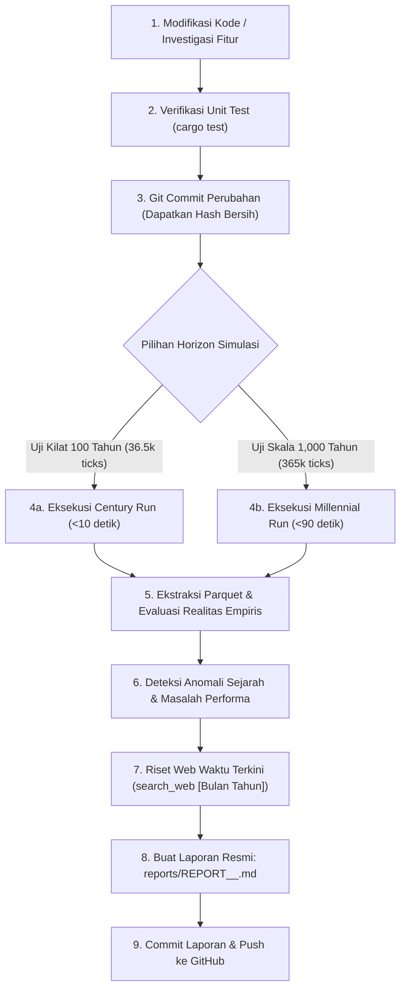

# 🚀 Simulation Benchmark & Audit Reporter Skill: Performance & Integrity Protocol

Skill ini menetapkan **Standar Operasional Prosedur (SOP) Baku** untuk menjamin keterlacakan (*traceability*), keabsahan empiris (*empirical validity*), evaluasi kondisi awal vs akhir terhadap realitas sejarah manusia, perlindungan performa tinggi (*high-throughput performance guardrails*), serta panduan ekspansi simulasi skala milenium (1,000 tahun) dalam simulator ABM `economy`.

---

## 🧭 Prinsip Utama (The Core Rules)

1. **Aturan "Commit-First Before Benchmark" (Anti-Dirty Benchmark)**:
   - **DILARANG KERAS** menjalankan benchmark atau rilis data resmi di atas *dirty working tree* (uncommitted changes).
   - Setiap perubahan kode wajib di-commit terlebih dahulu ke Git agar artefak Parquet dan laporan memiliki identitas *commit hash* yang presisi dan dapat direproduksi 100%.

2. **Standardisasi Penamaan Laporan (Commit-Embedded Naming)**:
   - Setiap berkas laporan wajib disimpan di direktori `reports/` dengan konvensi nama:
     ```
     reports/REPORT_<COMMIT_HASH>_<DESCRIPTOR>.md
     ```
     Contoh:
     - `reports/REPORT_a06ba65_SOLID_DECOMPOSITION_BENCHMARK.md` (100 tahun)
     - `reports/REPORT_b1c2d3e_MILLENNIUM1000_REALITY_EVALUATION.md` (1,000 tahun)

3. **Pemantauan Kecepatan & Efisiensi Eksekusi (TPS Performance Guardrail)**:
   - Kecepatan simulasi diukur dalam **TPS (Ticks Per Second)** dan **Wall-Clock Duration**.
   - **Standar Utama Benchmark**: **100 Tahun (Century Simulation / 36.500 ticks)** ditetapkan sebagai horizon baku utama pengujian reguler per-commit. Dengan penambahan mikro-mekanisme yang terus bertambah (patologi, deplesi modal, peluruhan pangan, kalkulasi pasar), horizon 100 tahun (~36.500 ticks) memberikan siklus feedback kilat (ideal <10–30 detik), menguji 3–5 generasi, serta memvalidasi 2.400 rilis tabel bulanan.
   - Target Baseline:
     - 100 Tahun (36.500 ticks): diselesaikan dalam **< 15 detik** (>= 2.500–4.000 TPS).
     - Run 1.000 tahun (365.000 ticks) diselesaikan dalam **< 90 detik** (hanya digunakan untuk milestone khusus skala milenium).
   - Jika sebuah perubahan kode menurunkan TPS >15%, investigasi alokasi memori (heap allocation/cloning) dan struktur loop wajib dilakukan melalui tabel mikro-profiler.

4. **Keterlacakan Parquet & Parameter Reproduksi**:
   - Seluruh output disimpan dalam folder berformat `output/run_id=<run_name>_<commit_hash>/`.
   - Parameter CLI baku untuk Century Run: `--seed 42 --ticks 36500 --duration day --initial-agents 50 --run-id century_seed42 --output-dir output`.

5. **Evaluasi Realitas Sejarah: Kondisi Awal vs Kondisi Akhir (Historical Reality Audit)**:
   - Setiap laporan wajib mengevaluasi transisi dari **Kondisi Awal ($T_0$)** menuju **Kondisi Akhir ($T_f$)** dan membandingkannya secara kritis terhadap **Realita Sejarah Peradaban Manusia**.
   - Jika hasil simulasi menunjukkan sesuatu yang **tidak seharusnya terjadi dalam sejarah manusia di realita** (anomali sejarah), agen **WAJIB mendiagnosis state atau mekanisme mikro apa yang belum sesuai realita** dan merekomendasikan perbaikannya.

6. **Mekanisme Observabilitas Langsung & Profiling Sub-Sistem (Live Heartbeat & Profiler)**:
   - Simulator wajib memancarkan **live progress heartbeat** secara berkala (misal tiap 5 tahun / 1.825 ticks pada run 100 tahun) yang menampilkan `[Year X | Tick Y (Z%)] Living: N | Total: M | Speed: T TPS | ETA: S s` agar jalannya simulasi transparan, tidak 'buta', dan kemacetan/stuck dapat terdeteksi dini.
   - Setiap akhir eksekusi wajib mencetak **Per-System Micro-Profiler Breakdown** (alokasi waktu nanodetik untuk `EnvironmentSystem`, `MetabolismSystem`, `LifecycleSystem`, `ExchangeSystem`, dan `StatisticSystem`) untuk mengidentifikasi bottleneck komputasi secara presisi.

7. **Audit Kompleksitas Algoritmik, Parsing Data & Efisiensi Big-O (Algorithmic & Parsing Audit Mandate)**:
   - Setiap laporan resmi **WAJIB MENJAWAB SECARA EKSPLISIT** 4 pertanyaan inti performa rekayasa perangkat lunak:
     1. *Apa gap dan masalah performa yang belum teratasi?* (Identifikasi sub-sistem terberat, alokasi memori berlebih, unindexed loops).
     2. *Apakah ada potensi untuk optimasi?* (Peluang reduksi footprint komputasi, penghapusan deep cloning, zero allocation).
     3. *Apakah masalah parsing dan serialisasi sudah menggunakan algoritma tercepat?* (Evaluasi overhead AST `serde_json::Value` pada hot path jutaan transaksi, perbandingan terhadap typed binary/zero-copy representation, dan eliminasi format string berulang).
     4. *Apakah ada notasi Big-O ($O(1)$ vs $O(N)$) terbaik yang bisa diterapkan?* (Konversi scanning riwayat berulang $O(N)$ menjadi *running accumulators* amortized $O(1)$ atau $O(\log N)$, direct table indexing, dan optimasi komparator sort).
   - Hasil audit ini wajib langsung ditindaklanjuti pada iterasi implementasi berikutnya.

8. **Kewajiban Riset Internet Berbasis Waktu Terkini (Mandatory Time-Anchored Web Research Rule)**:
   - Setiap kali mengidentifikasi kesenjangan (*gaps*), anomali realitas biofisik/sejarah, atau masalah performa komputasi (bottleneck, alokasi heap berlebih, kompleksitas algoritma, deplesi ekologis, laju peluruhan material, patologi, dsb.), agen **WAJIB MELAKUKAN RISET INTERNET** menggunakan tool `search_web`.
   - **Penyematan Waktu Presisi (Bulan & Tahun Berjalan)**:
     Setiap kueri pencarian **wajib menyematkan Bulan dan Tahun saat ini** (misal: "October 2026", "2026") untuk memperoleh literatur terkini, pola arsitektur mutakhir (*modern software architecture patterns*), dan *best practices* industri terdepan.
     - *Contoh Kueri Performa*: `"Rust zero allocation event ledger metadata pattern 2026"`, `"Rust fast event sourcing arena bitfield October 2026"`.
     - *Contoh Kueri Realitas*: `"sustainable fishery harvest model seasonal spawning logistic equation October 2026"`, `"empirical perishability organic decay rate hunter gatherer 2026"`.
   - **Kewajiban Dokumentasi Sitasi**:
     Setiap laporan benchmark wajib menyertakan ringkasan hasil riset internet ini pada Bab 13 dan 14, mencakup:
     1. Kueri pencarian yang digunakan dengan timestamp bulan & tahun.
     2. Temuan pola/best practice mutakhir dari komunitas ilmiah & engineering global.
     3. Rencana adopsi konkret pada iterasi implementasi berikutnya.

---

## 🔬 Matriks Evaluasi Kondisi Awal vs Akhir Terhadap Realita Sejarah

Setiap analisis wajib mengisi dan memeriksa 6 dimensi komparasi realitas sejarah berikut:

| Dimensi Evaluasi | Kondisi Awal ($T_0$) | Kondisi Akhir ($T_f$) | Tolok Ukur Realitas Sejarah Manusia | Detektor Anomali & Diagnosa Mekanisme |
| :--- | :--- | :--- | :--- | :--- |
| **1. Dinamika Demografi & Pertumbuhan** | $N_0 = 50$ perintis homogen (Gen 1, usia 20-30). | $N_f$ penyintas, piramida usia, $G_{max}$ generasi. | Masyarakat agraris/forager pra-industri memiliki laju pertumbuhan tahunan (CAGR) berkisar **0.0% s/d 0.3%**. Populasi stabil bertumbuh perlahan sesuai daya dukung tanpa kepunahan mendadak. | ⚠️ **Anomali Kepunahan Lambat / Ledakan Tak Terkendali**: Jika populasi menyusut mendekati 0 atau meledak ribuan jiwa tanpa kendala pangan. *Diagnosa*: Cek ambang kalori fertilitas, parental care, atau mobilitas spasial ke simpul pangan. |
| **2. Barang Modal & Keausan Fisik (*Capital Longevity*)** | 0 alat modal (hanya kayu gelondongan mentah). | Total alat modal beredar (Kapak, Jaring, Rakit). | Alat batu, kayu, dan anyaman purba **tidak berumur abadi**. Mengalami aus, retak, patah, atau lapuk seiring frekuensi pemakaian (*depreciation & wear-and-tear*). | ⚠️ **Anomali Modal Abadi (*Immortal Capital*)**: Jika alat yang diproduksi tidak pernah berkurang/rusak sehingga menumpuk ratusan unit per kapita. *Diagnosa*: Belum ada pengurangan integritas fisik (*durability*) per pemakaian tebang/tangkap. |
| **3. Ketahanan Komoditas & Pembusukan (*Perishability*)** | Makanan segar (ikan, beri) dan tahan simpan (gandum). | Komposisi makanan dalam kantong inventori warga. | Protein basah (ikan segar) dan buah beri membusuk dalam hitungan hari jika tidak diasinkan/dikeringkan. Penemuan garam & pengasinan bernilai tinggi *karena* mencegah pembusukan. | ⚠️ **Anomali Pangan Abadi (*Eternal Freshness*)**: Jika warga menyimpan ikan segar selama berbulan-bulan tanpa garam tanpa membusuk. *Diagnosa*: `is_perishable: true` hanya metadata pasif, belum dieksekusi oleh `MetabolismSystem`. |
| **4. Keberlanjutan Biomassa & Daya Dukung (*Carrying Capacity*)** | Simpul alam perawan 100% matang (*peak virgin biomass*). | Kematangan (*maturity %*) hutan, perairan, dan padang gandum. | Pemanfaatan sumber daya alam harus menghasilkan ekuilibrium hayati logistik. Penebangan berlebihan memicu kelangkaan kayu lokal yang mendorong inovasi atau konservasi. | ⚠️ **Anomali Eksploitasi Mutlak (*Deforestation Trap*)**: Jika hutan kayu habis total (0%) tanpa kemampuan memulihkan diri. *Diagnosa*: Kecepatan tebang melampaui kurva regenerasi logistik $r \cdot S (1 - S/K)$. |
| **5. Kedalaman Generasi & Suksesi Warisan** | Generasi 1 (Pioneer Settlers). | Generasi $G_{max}$ (Gen 4-5 pada 100 thn; Gen 35-45 pada 1,000 thn). | Suksesi biologis berlangsung mulus. Kematian orang tua mewariskan alat dan aset ke anak/pasangan, bukan hilang musnah ke ruang hampa. | ⚠️ **Anomali Suksesi Terputus (*Generational Stagnation*)**: Jika generasi berhenti di Gen 1 atau 2 setelah ratusan tahun. *Diagnosa*: Kematian dini anak atau kegagalan ikatan pernikahan generasi baru. |
| **6. Pengetahuan & Pembagian Kerja (*Division of Labor*)** | 0 cetak biru teknologi (hanya naluri foraging dasar). | Gagasan beredar, transaksi magang (*apprenticeship*), spesialisasi. | Pengetahuan menyebar melalui pengajaran antargenerasi (magang). Spesialisasi muncul di mana pengrajin alat menukar alat dengan bahan pangan peternak/nelayan (*Adam Smith*). | ⚠️ **Anomali Amnesia Kolektif / Autarki Total**: Jika tidak ada pertukaran pengetahuan atau warga hidup 100% autarki tanpa pernah barter. *Diagnosa*: Kurangnya insentif diferensiasi utilitas marginal Hayekian. |
| **7. Spektrum Umur Simpan & Entropi Material (*Material Longevity Spectrum*)** | Seluruh item baru diproduksi/dipanen. | Usia dan daya tahan stok barang beredar (anorganik vs organik). | **Apakah masuk akal barang bertahan puluhan tahun?**<br>• *Masuk Akal (Anorganik Tahan Lama)*: Batu (`Stone Axe`), Cangkang (`Cowrie Shells`), Garam (`Rock Salt`), dan Tembikar Keramik (`Pottery Jar`) tahan puluhan s/d ratusan tahun sebagai pusaka (*heirloom*) lintas generasi.<br>• *Tidak Masuk Akal (Organik Rentan Entropi)*: Kayu bakar mentah (`Timber`), keranjang serat (`Woven Basket`), jaring serat (`Fishing Net`), herbal kering (`Herbal Medicine`), dan biji gandum lepas (`Wild Grain`) lapuk/hancur oleh rayap, jamur, oksidasi, dan serangga dalam 6 bulan s/d 2–3 tahun tanpa wadah kedap khusus. | ⚠️ **Anomali Bahan Organik Abadi (*Immortal Organic Matter*)**: Jika komoditas organik seperti kayu gelondongan, keranjang serat, atau obat herbal tersimpan selama puluhan tahun di tas warga tanpa pernah melapuk atau kadaluarsa. *Diagnosa*: Belum adanya pemodelan entropi pasif (*passive weathering & organic decay*) berbasis waktu kalender. |

---

## 🔄 Alur Kerja Eksekusi Baku (Standard Workflow Loop)



---

## 📋 Struktur Standard Laporan Benchmark (`reports/REPORT_<commit>_*.md`)

Setiap laporan wajib memuat 14 bab eksekutif berikut:

1. **Header Metadata Eksekusi**:
   - Commit Hash (Short & Full)
   - Perintah Eksekusi CLI & Master Seed
   - Durasi Waktu Nyata (Wall Clock) & Throughput (TPS)
   - Direktori Output Parquet
2. **Ringkasan Eksekutif & Temuan Kunci (*Executive Summary*)**:
   - Konteks run (100 tahun vs 1,000 tahun).
   - Temuan makro terpenting.
3. **Matriks Evaluasi Kondisi Awal vs Akhir Terhadap Realita Sejarah**:
   - Tabel komparasi 7 dimensi realitas sejarah.
   - Evaluasi kelayakan antropologis.
4. **Deteksi Anomali Realita & Diagnosa Mekanisme (*Root Cause Diagnostics*)**:
   - Identifikasi anomali (misal: modal abadi, bahan organik abadi, pangan tidak membusuk, kepunahan demografis, dsb.).
   - Analisis kode modul mana yang belum memodelkan hukum fisika/biologi terkait.
5. **Audit Siklus Hidup & Demografi Multi-Generasi**:
   - Populasi hidup vs total kelahiran historis.
   - Piramida usia dan generasi terdalam yang tercapai.
   - Rasio ketergantungan dan rasio jenis kelamin.
6. **Evaluasi Epidemiologi, Penyakit & Pengobatan (*Healthcare & Pathology Audit*)**:
   - Pemodelan kondisi patologis: demam/kedinginan (`is_sick`), beban metabolisme panas tubuh (+300 kkal), dan risiko mortalitas meningkat.
   - Angka kesakitan warga hidup, kematian akibat komplikasi infeksi/demam vs kelaparan vs usia tua.
   - Intervensi terapeutik: swamedikasi obat herbal, jasa pengobatan keluarga, dan transaksi jasa dokter/tabib (`SERVICE_MEDICAL`).
7. **Audit Transaksi Ledger & Sirkulasi Aset (Ultimate Ledger)**:
   - Rincian jenis transaksi atomik (panen, manufaktur alat/wadah, farmakope, jasa medis, barter, jasa magang, eureka).
   - Sirkulasi dan intensitas barang modal.
8. **Daftar Kronologis Kemunculan & Penemuan Item Sepanjang Sejarah**:
   - Tabel urutan kronologis pertama kali setiap item muncul / ditemukan (ID, Nama Item, Kategori, Tick, Tahun Sejarah, Konteks Kemunculan).
   - Analisis pola kemunculan barang (dari foraging primitif -> perkakas modal -> teknologi pengawetan -> jasa keahlian medis dan edukasi).
9. **Evaluasi Kesenjangan Item Sejarah (*Archaeological Item Gap Analysis*)**:
   - Matriks evaluasi 5 era arkeologi peradaban manusia:
     - *Paleolitik Bawah/Tengah (300k - 50k BP)*: Api, kapak genggam kasar, perburuan, herba kunyah.
     - *Paleolitik Atas (50k - 10k BP)*: Kapak batu halus, rakit perairan, pakaian kulit, jarum tulang.
     - *Mesolitik (10k - 8k BP)*: Jaring ikan anyam, garam & pengasinan, panah/jebakan, kerang hias, wadah anyam.
     - *Neolitik (8k - 4k BP)*: Budidaya gandum, tembikar/gerabah penyimpan pangan, hewan domestik, tenun tekstil.
     - *Logam & Perunggu (4k - 1.2k BP)*: Metalurgi, tungku smelter, roda/gerobak, farmakope formal, sistem pembukuan/uang.
   - Evaluasi komparatif: apa yang telah ada di model vs apa yang berstatus kesenjangan (*item gaps*) yang perlu dikembangkan berikutnya.
10. **Audit Spektrum Umur Simpan, Entropi Material & Evaluasi Kelayakan Dekade (*Material Longevity Spectrum*)**:
    - **Uji Kelayakan Dekade**: Evaluasi apakah masuk akal suatu item bertahan selama puluhan tahun berdasarkan sifat materialnya.
    - *Barang Anorganik Tahan Lama (Decades to Centuries)*: Batu (`Stone Axe`), Cangkang Kalsium Karbonat (`Cowrie Shells`), Kristal Garam (`Rock Salt`), dan Tembikar Keramik Bakar (`Pottery Jar`) terbukti arkeologis bertahan puluhan hingga ratusan tahun sebagai pusaka (*heirloom*) lintas generasi.
    - *Bahan Organik Rentan Entropi (Months to a Few Years)*: Kayu bakar mentah (`Timber`), jaring anyaman (`Fishing Net`), keranjang anyaman serat (`Woven Basket`), tanaman obat kering (`Herbal Medicine`), dan biji gandum lepas (`Wild Grain`) wajib mengalami laju entropi pelapukan pasif (rayap, jamur, oksidasi, kelembaban) dalam 6 bulan s/d 2-3 tahun tanpa wadah khusus.
11. **Daya Dukung Ekologis & Kelestarian Sumber Daya (*Carrying Capacity*)**:
    - Status biomassa dan tingkat kematangan (*maturity %*) seluruh simpul alam.
12. **Profil Performa Komputasi & Rincian Mikro-Profiler Sub-Sistem**:
    - Analisis throughput total (TPS rata-rata, instantaneous min/max, dan wall-clock duration).
    - Tabel alokasi waktu per sub-sistem (`EnvironmentSystem`, `MetabolismSystem`, `LifecycleSystem`, `ExchangeSystem`, `StatisticSystem`) dengan breakdown persentase dan latensi per tick.
    - Diagnosis modul terberat dan perbandingan terhadap target baseline.
13. **Audit Kompleksitas Algoritmik, Parsing, dan Evaluasi Big-O (Algorithmic Complexity & Optimization Audit)**:
    - **Jawaban Wajib 4 Pertanyaan Kunci Performa**:
      1. *Apa gap dan masalah performa yang belum teratasi?* (Identifikasi sub-sistem terberat, alokasi memori berlebih, unindexed loops).
      2. *Apakah ada potensi untuk optimasi?* (Peluang reduksi footprint komputasi, penghapusan deep cloning, zero allocation).
      3. *Apakah masalah parsing dan serialisasi sudah menggunakan algoritma tercepat?* (Evaluasi overhead AST `serde_json::Value` pada hot path jutaan transaksi, perbandingan terhadap typed binary/zero-copy representation, dan eliminasi format string berulang).
      4. *Apakah ada notasi Big-O ($O(1)$ vs $O(N)$) terbaik yang bisa diterapkan?* (Konversi scanning riwayat berulang $O(N)$ menjadi *running accumulators* amortized $O(1)$ atau $O(\log N)$, direct table indexing, dan optimasi komparator sort).
    - **Sub-Bab Wajib: Riset Web & Best Practice Terkini ([Bulan] [Tahun])**:
      - Kueri pencarian `search_web` presisi bertanggal bulan & tahun saat ini (misal: `"Rust zero allocation event ledger metadata pattern 2026"`).
      - Ringkasan pola arsitektur mutakhir (seperti bitfield encoding, embedded storage, periodic non-autonomous logistic harvesting models).
      - Rencana implementasi konkret pada kode sumber.
14. **Rekomendasi Langkah Pengembangan & Rencana Iterasi Berikutnya**:
    - Usulan perbaikan mekanisme mikro untuk iterasi berikutnya berdasarkan evaluasi realitas, hasil profiler, dan solusi best practice dari riset internet.

---

## 🛠️ CLI Runner 100 Tahun Baku (Century Simulation)

### Perintah Benchmark Standar (100 Tahun / 36.500 Ticks — ~10-25 Detik):
```bash
COMMIT_HASH=$(git rev-parse --short HEAD)
cargo run --release -- \
  --seed 42 \
  --ticks 36500 \
  --duration day \
  --initial-agents 50 \
  --run-id century_seed42_${COMMIT_HASH} \
  --output-dir output
```

### Analisis Ekstraksi Otomatis:
```bash
cargo run --example analyze_century output/run_id=century_seed42_${COMMIT_HASH}
```

### Opsi Khusus Milestone: Millennial Run (1.000 Tahun / 365.000 Ticks):
```bash
COMMIT_HASH=$(git rev-parse --short HEAD)
cargo run --release -- \
  --seed 42 \
  --ticks 365000 \
  --duration day \
  --initial-agents 50 \
  --run-id millennium_seed42_${COMMIT_HASH} \
  --output-dir output
```
