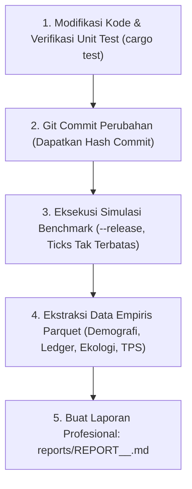

# 🚀 Simulation Benchmark & Audit Reporter Skill: Performance & Integrity Protocol

Skill ini menetapkan **Standar Operasional Prosedur (SOP) Baku** untuk menjamin keterlacakan (*traceability*), keabsahan empiris (*empirical validity*), dan perlindungan performa tinggi (*high-throughput performance guardrails*) dalam simulasi ABM `economy`.

---

## 🧭 Prinsip Utama (The Core Rules)

1. **Aturan "Commit-First Before Benchmark" (Anti-Dirty Benchmark)**:
   - **DILARANG KERAS** menjalankan benchmark atau rilis data resmi di atas *dirty working tree* (uncommitted changes).
   - Setiap perubahan kode wajib di-commit terlebih dahulu ke Git agar artefak Parquet dan laporan memiliki identitas *commit hash* yang presisi dan dapat direproduksi 100%.

2. **Standardisasi Penamaan Laporan (Commit-Embedded Naming)**:
   - Setiap berkas laporan wajib disimpan di direktori `reports/` dengan konvensi nama:
     ```
     reports/REPORT_<COMMIT_HASH>_<DESCRIPTOR>.md
     ```
     Contoh: `reports/REPORT_a1b2c3d_CENTURY100_DEMO_RECOVERY.md`.

3. **Pemantauan Kecepatan & Efisiensi Eksekusi (TPS Performance Guardrail)**:
   - Kecepatan simulasi diukur dalam **TPS (Ticks Per Second)** dan **Wall-Clock Duration**.
   - Simulator ditargetkan berjalan pada mode *uncapped speed* dengan batas minimum performa:
     - Target Baseline: **>= 4,000 TPS** pada mode `--release` (36,500 ticks / 100 tahun simulasi diselesaikan dalam <10 detik).
     - Jika sebuah PR atau modifikasi algoritma menurunkan TPS >15%, investigasi alokasi memori (heap allocation/cloning) dan struktur loop wajib dilakukan.

4. **Keterlacakan Parquet & Parameter Reproduksi**:
   - Seluruh output disimpan dalam folder berformat `output/run_id=<run_name>_<commit_hash>/`.
   - Parameter CLI wajib dicantumkan lengkap: `--seed <S> --ticks <T> --duration <D> --initial-agents <N> --output-dir <O>`.

---

## 🔄 Alur Kerja Eksekusi Baku (Standard Workflow Loop)

Setiap siklus pengujian atau perbaikan mengikuti 5 langkah berurutan:



---

## 📋 Struktur Standard Laporan Benchmark (`reports/REPORT_<commit>_*.md`)

Setiap laporan yang dihasilkan wajib memuat 7 komponen eksekutif berikut:

1. **Header Metadata Eksekusi**:
   - Commit Hash (Short & Full)
   - Master Seed & Parameter Reproduksi
   - Durasi Waktu Nyata (Wall-Clock Seconds) & Throughput (TPS)
   - Status Direktori Output Parquet
2. **Ringkasan Eksekutif & Temuan Kunci (*Executive Summary*)**:
   - Latar belakang perubahan kode.
   - Hasil makro yang diobservasi.
3. **Audit Siklus Hidup & Demografi Multi-Generasi**:
   - Populasi hidup akhir vs total kelahiran historis.
   - Distribusi kohor usia (Balita, Usia Produktif, Lansia).
   - Rasio ketergantungan (*Dependency Ratio*) dan Rasio Jenis Kelamin (*Sex Ratio*).
   - Generasi terdalam yang dicapai (Gen 1 $\to$ Gen $N$).
4. **Audit Transaksi Ledger & Sirkulasi Aset (Ultimate Ledger)**:
   - Total transaksi atomik tercatat.
   - Rincian jenis transaksi: Panen, Pembuatan Alat Modal, Pertukaran Jasa, Barter Bilateral, Penemuan Gagasan (*Eureka*).
   - Intensitas barang modal (*Capital Goods Intensity*).
5. **Daya Dukung Ekologis & Kelestarian Sumber Daya (*Carrying Capacity*)**:
   - Status cadangan dan tingkat kematangan (*maturity %*) seluruh simpul alam.
   - Peringatan eksploitasi (*Tragedy of the Commons*).
6. **Profil Performa & Analisis Skalabilitas**:
   - Kecepatan eksekusi (TPS).
   - Waktu kompilasi dan ukuran file Parquet.
   - Deteksi *bottleneck* komputasi (apakah alokasi memori atau loop skalar melambat).
7. **Matriks Kepatuhan Skill Audit (Checklist Reality, Emergence, SOLID)**:
   - Verifikasi biophysical reality (`abm-reality-auditor`).
   - Verifikasi emergent complexity (`emergence-auditor`).
   - Verifikasi ukuran file & modularitas (`solid-scale-auditor`).

---

## 🛠️ Template Script Pembangkit Laporan Otomatis

Untuk mempercepat pembuatan laporan dengan data aktual, gunakan pola ekstraksi parquet berbasis contoh:

```bash
# 1. Pastikan repo bersih dan dapatkan commit hash
COMMIT_HASH=$(git rev-parse --short HEAD)

# 2. Jalankan simulasi release
cargo run --release -- --seed 42 --ticks 36500 --duration day --initial-agents 50 --run-id century_seed42 --output-dir output

# 3. Jalankan script analisis analitik
cargo run --example analyze_century
```
