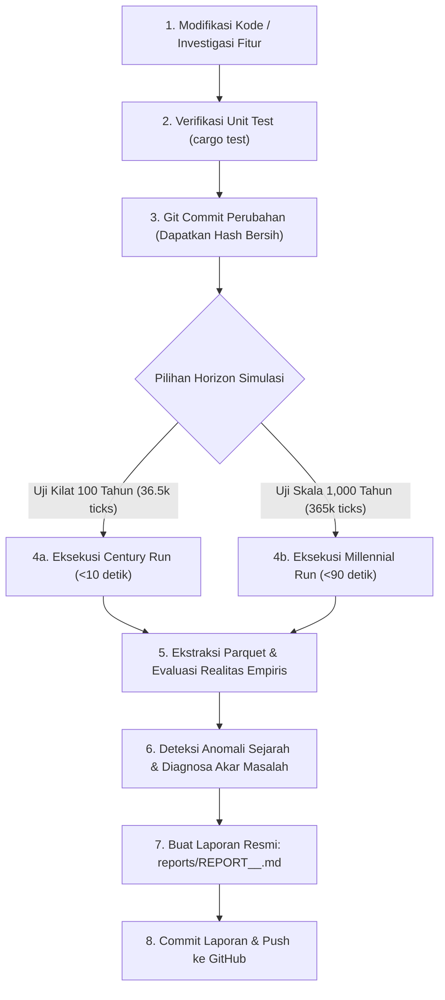

# 🚀 Simulation Benchmark & Audit Reporter Skill: Performance & Integrity Protocol

Skill ini menetapkan **Standar Operasional Prosedur (SOP) Baku** untuk menjamin keterlacakan (*traceability*), keabsahan empiris (*empirical validity*), evaluasi kondisi awal vs akhir terhadap realitas sejarah manusia, perlindungan performa tinggi (*high-throughput performance guardrails*), serta panduan ekspansi simulasi skala milenium (1,000 tahun) dalam simulator ABM `economy`.

---

## 🧭 Prinsip Utama (The Core Rules)

1. **Aturan "Commit-First Before Benchmark" (Anti-Dirty Benchmark)**:
   - **DILARANG KERAS** menjalankan benchmark atau rilis data resmi di atas *dirty working tree* (uncommitted changes).
   - Setiap perubahan kode wajib di-commit terlebih dahulu ke Git agar artefak Parquet dan laporan memiliki identitas *commit hash* yang presisi dan dapat direproduksi 100%.

2. **Standardisasi Penamaan Laporan (Commit-Embedded Naming)**:
   - Setiap berkas laporan wajib disimpan di direktori `reports/` dengan konvensi nama:
     ```
     reports/REPORT_<COMMIT_HASH>_<DESCRIPTOR>.md
     ```
     Contoh:
     - `reports/REPORT_a06ba65_SOLID_DECOMPOSITION_BENCHMARK.md` (100 tahun)
     - `reports/REPORT_b1c2d3e_MILLENNIUM1000_REALITY_EVALUATION.md` (1,000 tahun)

3. **Pemantauan Kecepatan & Efisiensi Eksekusi (TPS Performance Guardrail)**:
   - Kecepatan simulasi diukur dalam **TPS (Ticks Per Second)** dan **Wall-Clock Duration**.
   - Simulator ditargetkan berjalan pada mode *uncapped speed* dengan batas minimum performa:
     - Target Baseline: **>= 4,000 TPS** pada mode `--release`.
     - 100 Tahun (36,500 ticks) diselesaikan dalam **< 10 detik**.
     - 1,000 Tahun (365,000 ticks) diselesaikan dalam **< 90 detik** (1.5 menit).
     - Jika sebuah perubahan kode menurunkan TPS >15%, investigasi alokasi memori (heap allocation/cloning) dan struktur loop wajib dilakukan.

4. **Keterlacakan Parquet & Parameter Reproduksi**:
   - Seluruh output disimpan dalam folder berformat `output/run_id=<run_name>_<commit_hash>/`.
   - Parameter CLI wajib dicantumkan lengkap: `--seed <S> --ticks <T> --duration <D> --initial-agents <N> --run-id <R> --output-dir <O>`.

5. **Evaluasi Realitas Sejarah: Kondisi Awal vs Kondisi Akhir (Historical Reality Audit)**:
   - Setiap laporan wajib mengevaluasi transisi dari **Kondisi Awal ($T_0$)** menuju **Kondisi Akhir ($T_f$)** dan membandingkannya secara kritis terhadap **Realita Sejarah Peradaban Manusia**.
   - Jika hasil simulasi menunjukkan sesuatu yang **tidak seharusnya terjadi dalam sejarah manusia di realita** (anomali sejarah), agen **WAJIB mendiagnosis state atau mekanisme mikro apa yang belum sesuai realita** dan merekomendasikan perbaikannya.

6. **Eskalasi Horizon Skala Milenium (1,000 Tahun / 365,000 Ticks)**:
   - Jika performa simulasi terbukti sangat cepat (TPS $\ge 4,000$, run 100 tahun < 10 detik), pertimbangkan untuk mengeksekusi run **1,000 tahun** (`365,000 ticks`).
   - Horizon 1,000 tahun adalah pengujian sejati (*acid test*) bagi suksesi peradaban: menguji stabilitas multi-generasi (35–45 generasi), akumulasi modal jangka panjang, serta resistensi terhadap kepunahan demografis atau akumulasi aset abnormal.

---

## 🔬 Matriks Evaluasi Kondisi Awal vs Akhir Terhadap Realita Sejarah

Setiap analisis wajib mengisi dan memeriksa 6 dimensi komparasi realitas sejarah berikut:

| Dimensi Evaluasi | Kondisi Awal ($T_0$) | Kondisi Akhir ($T_f$) | Tolok Ukur Realitas Sejarah Manusia | Detektor Anomali & Diagnosa Mekanisme |
| :--- | :--- | :--- | :--- | :--- |
| **1. Dinamika Demografi & Pertumbuhan** | $N_0 = 50$ perintis homogen (Gen 1, usia 20-30). | $N_f$ penyintas, piramida usia, $G_{max}$ generasi. | Masyarakat agraris/forager pra-industri memiliki laju pertumbuhan tahunan (CAGR) berkisar **0.0% s/d 0.3%**. Populasi stabil bertumbuh perlahan sesuai daya dukung tanpa kepunahan mendadak. | ⚠️ **Anomali Kepunahan Lambat / Ledakan Tak Terkendali**: Jika populasi menyusut mendekati 0 atau meledak ribuan jiwa tanpa kendala pangan. *Diagnosa*: Cek ambang kalori fertilitas, parental care, atau mobilitas spasial ke simpul pangan. |
| **2. Barang Modal & Keausan Fisik (*Capital Longevity*)** | 0 alat modal (hanya kayu gelondongan mentah). | Total alat modal beredar (Kapak, Jaring, Rakit). | Alat batu, kayu, dan anyaman purba **tidak berumur abadi**. Mengalami aus, retak, patah, atau lapuk seiring frekuensi pemakaian (*depreciation & wear-and-tear*). | ⚠️ **Anomali Modal Abadi (*Immortal Capital*)**: Jika alat yang diproduksi tidak pernah berkurang/rusak sehingga menumpuk ratusan unit per kapita. *Diagnosa*: Belum ada pengurangan integritas fisik (*durability*) per pemakaian tebang/tangkap. |
| **3. Ketahanan Komoditas & Pembusukan (*Perishability*)** | Makanan segar (ikan, beri) dan tahan simpan (gandum). | Komposisi makanan dalam kantong inventori warga. | Protein basah (ikan segar) dan buah beri membusuk dalam hitungan hari jika tidak diasinkan/dikeringkan. Penemuan garam & pengasinan bernilai tinggi *karena* mencegah pembusukan. | ⚠️ **Anomali Pangan Abadi (*Eternal Freshness*)**: Jika warga menyimpan ikan segar selama berbulan-bulan tanpa garam tanpa membusuk. *Diagnosa*: `is_perishable: true` hanya metadata pasif, belum dieksekusi oleh `MetabolismSystem`. |
| **4. Keberlanjutan Biomassa & Daya Dukung (*Carrying Capacity*)** | Simpul alam perawan 100% matang (*peak virgin biomass*). | Kematangan (*maturity %*) hutan, perairan, dan padang gandum. | Pemanfaatan sumber daya alam harus menghasilkan ekuilibrium hayati logistik. Penebangan berlebihan memicu kelangkaan kayu lokal yang mendorong inovasi atau konservasi. | ⚠️ **Anomali Eksploitasi Mutlak (*Deforestation Trap*)**: Jika hutan kayu habis total (0%) tanpa kemampuan memulihkan diri. *Diagnosa*: Kecepatan tebang melampaui kurva regenerasi logistik $r \cdot S (1 - S/K)$. |
| **5. Kedalaman Generasi & Suksesi Warisan** | Generasi 1 (Pioneer Settlers). | Generasi $G_{max}$ (Gen 4-5 pada 100 thn; Gen 35-45 pada 1,000 thn). | Suksesi biologis berlangsung mulus. Kematian orang tua mewariskan alat dan aset ke anak/pasangan, bukan hilang musnah ke ruang hampa. | ⚠️ **Anomali Suksesi Terputus (*Generational Stagnation*)**: Jika generasi berhenti di Gen 1 atau 2 setelah ratusan tahun. *Diagnosa*: Kematian dini anak atau kegagalan ikatan pernikahan generasi baru. |
| **6. Pengetahuan & Pembagian Kerja (*Division of Labor*)** | 0 cetak biru teknologi (hanya naluri foraging dasar). | Gagasan beredar, transaksi magang (*apprenticeship*), spesialisasi. | Pengetahuan menyebar melalui pengajaran antargenerasi (magang). Spesialisasi muncul di mana pengrajin alat menukar alat dengan bahan pangan peternak/nelayan (*Adam Smith*). | ⚠️ **Anomali Amnesia Kolektif / Autarki Total**: Jika tidak ada pertukaran pengetahuan atau warga hidup 100% autarki tanpa pernah barter. *Diagnosa*: Kurangnya insentif diferensiasi utilitas marginal Hayekian. |

---

## 🔄 Alur Kerja Eksekusi Baku (Standard Workflow Loop)



---

## 📋 Struktur Standard Laporan Benchmark (`reports/REPORT_<commit>_*.md`)

Setiap laporan wajib memuat 8 bab eksekutif berikut:

1. **Header Metadata Eksekusi**:
   - Commit Hash (Short & Full)
   - Perintah Eksekusi CLI & Master Seed
   - Durasi Waktu Nyata (Wall Clock) & Throughput (TPS)
   - Direktori Output Parquet
2. **Ringkasan Eksekutif & Temuan Kunci (*Executive Summary*)**:
   - Konteks run (100 tahun vs 1,000 tahun).
   - Temuan makro terpenting.
3. **Matriks Evaluasi Kondisi Awal vs Akhir Terhadap Realita Sejarah**:
   - Tabel komparasi 6 dimensi realitas sejarah.
   - Evaluasi kelayakan antropologis.
4. **Deteksi Anomali Realita & Diagnosa Mekanisme (*Root Cause Diagnostics*)**:
   - Identifikasi anomali (misal: modal abadi, pangan tidak membusuk, dsb.).
   - Analisis kode modul mana yang belum memodelkan hukum fisika/biologi terkait.
5. **Audit Siklus Hidup & Demografi Multi-Generasi**:
   - Populasi hidup vs total kelahiran historis.
   - Piramida usia dan generasi terdalam yang tercapai.
   - Rasio ketergantungan dan rasio jenis kelamin.
6. **Audit Transaksi Ledger & Sirkulasi Aset (Ultimate Ledger)**:
   - Rincian jenis transaksi atomik (panen, manufaktur alat, barter, jasa magang, eureka).
   - Sirkulasi dan intensitas barang modal.
7. **Daya Dukung Ekologis & Kelestarian Sumber Daya (*Carrying Capacity*)**:
   - Status biomassa dan tingkat kematangan (*maturity %*) seluruh simpul alam.
8. **Profil Performa Komputasi & Rekomendasi Langkah Berikutnya**:
   - Analisis throughput TPS.
   - Usulan perbaikan mekanisme mikro untuk iterasi berikutnya.

---

## 🛠️ CLI Runner 100 Tahun vs 1,000 Tahun

### Opsi A: Century Run (100 Tahun / 36,500 Ticks — ~8.4 Detik)
```bash
COMMIT_HASH=$(git rev-parse --short HEAD)
cargo run --release -- \
  --seed 42 \
  --ticks 36500 \
  --duration day \
  --initial-agents 50 \
  --run-id century_seed42 \
  --output-dir output
```

### Opsi B: Millennial Run (1,000 Tahun / 365,000 Ticks — ~84 Detik)
```bash
COMMIT_HASH=$(git rev-parse --short HEAD)
cargo run --release -- \
  --seed 42 \
  --ticks 365000 \
  --duration day \
  --initial-agents 50 \
  --run-id millennium_seed42 \
  --output-dir output
```

### Analisis Ekstraksi Otomatis:
```bash
cargo run --example analyze_century output/run_id=millennium_seed42_${COMMIT_HASH}
```
