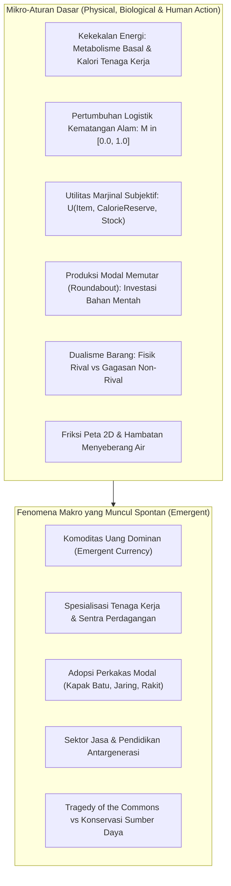
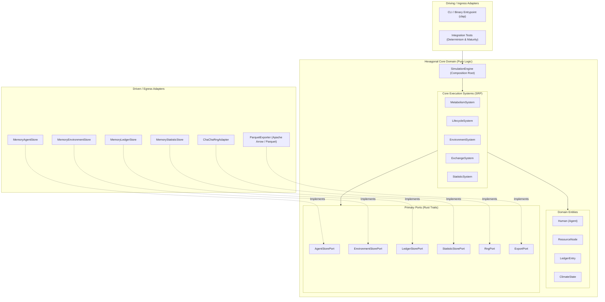
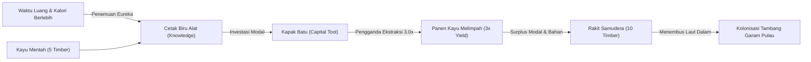

# 🏛️ Deterministic ABM Economic Simulation Engine (Rust)

[](https://www.rust-lang.org)
[](LICENSE)
[]()
[]()
[]()

Simulator ekonomi berbasis agen (**Agent-Based Modeling / ABM**) berkinerja tinggi dan **100% deterministik** yang ditulis dalam bahasa pemrograman **Rust**. Sistem ini dirancang berdasarkan prinsip **Complex Adaptive Systems (CAS)**, mikro-fondasi termodinamika-biologis, teori ekonomi Austria (*Austrian Economics*), arsitektur heksagonal murni (**Ports & Adapters**), dan persistensi data analitik berkecepatan tinggi ke format **Apache Parquet**.

---

## 📑 Daftar Isi

- [1. Filosofi & Paradigma Emergence](#1-filosofi--paradigma-emergence)
- [2. Arsitektur Perangkat Lunak (Hexagonal & SOLID)](#2-arsitektur-perangkat-lunak-hexagonal--solid)
- [3. Mikro-Fondasi & Mekanisme Inti](#3-mikro-fondasi--mekanisme-inti)
  - [3.1 Termodinamika & Metabolisme Tubuh](#31-termodinamika--metabolisme-tubuh)
  - [3.2 Kematangan Biologis Kontinu & Pertumbuhan Logistik](#32-kematangan-biologis-kontinu--pertumbuhan-logistik)
  - [3.3 Siklus Modal Austria (*Böhm-Bawerk Roundaboutness*)](#33-siklus-modal-austria-böhm-bawerk-roundaboutness)
  - [3.4 Ekonomi Pengetahuan Non-Rival & Sektor Jasa](#34-ekonomi-pengetahuan-non-rival--sektor-jasa)
  - [3.5 Barter Subjektif & Evolusi Uang Spontan (*Carl Menger*)](#35-barter-subjektif--evolusi-uang-spontan-carl-menger)
  - [3.6 Spasial, Geografi 2D & Hambatan Lingkungan](#36-spasial-geografi-2d--hambatan-lingkungan)
- [4. The Ultimate Ledger ($N$-ke-$M$ Atomic Ledger)](#4-the-ultimate-ledger-n-ke-m-atomic-ledger)
- [5. Sistem Statistik & Keterbukaan Data (*Data Openness*)](#5-sistem-statistik--keterbukaan-data-data-openness)
- [6. Persistensi Kolumnar Apache Arrow & Parquet](#6-persistensi-kolumnar-apache-arrow--parquet)
- [7. Verifikasi Empiris & Benchmark Kinerja](#7-verifikasi-empiris--benchmark-kinerja)
- [8. Panduan Penggunaan CLI](#8-panduan-penggunaan-cli)
- [9. Analisis Data dengan DuckDB & Python](#9-analisis-data-dengan-duckdb--python)
- [10. Pengujian & Jaminan Determinisme](#10-pengujian--jaminan-determinisme)

---

## 1. Filosofi & Paradigma Emergence

Mayoritas simulator ekonomi tradisional mengandalkan pendekatan *top-down* (makro terencana) atau *scripting* teleologis eksplisit (misal: memberikan teknologi baru secara terjadwal, mendikte harga pasar secara sepihak, atau menyuntikkan uang fiat buatan). 

Engine ini dibangun di atas paradigma yang berlawanan: **Zero-Scripting Complex Adaptive Systems (CAS)**. Semua fenomena peradaban makro harus lahir secara **spontan (emergent)** dari hukum mikro fisik, biologis, dan perilaku individu:



### Prinsip Bebas Intervensi (*No God-Mode Scripting*)
1. **Tidak Ada Uang Fiat Sejak Awal**: Tidak ada variabel `wallet_balance`. Agen hanya memiliki stok barang fisik nyata di inventori. Uang muncul secara endogen dari komoditas yang paling likuid dan awet (*Mengerian origin of money*).
2. **Tidak Ada Pengganda Kekuatan Buatan**: Kecepatan ekstraksi dan mobilitas tidak ditingkatkan lewat cheat/skill point gaib, melainkan menuntut kepemilikan perkakas fisik modal (*capital tools*) yang dirakit dari pengorbanan bahan mentah dan waktu.
3. **Tidak Ada Pohon Teknologi yang Dipaksa**: Gagasan dan resep tidak terbuka otomatis berdasarkan tahun, melainkan menuntut penemuan ilmiah spontan (*Eureka*) oleh agen yang memiliki cadangan makanan berlebih (waktu luang untuk bereksperimen).

---

## 2. Arsitektur Perangkat Lunak (Hexagonal & SOLID)

Proyek ini mengadopsi **Hexagonal Architecture (Ports and Adapters)** secara ketat guna memisahkan domain inti dari lapisan infrastruktur, I/O, format serialisasi, dan generator acak.



### Penerapan Prinsip SOLID
- **Single Responsibility Principle (SRP)**: Entitas `Human` adalah representasi state murni. Perhitungan penuaan, pernikahan, dan kematian dipisah ke `LifecycleSystem`; metabolisme dan kelaparan ke `MetabolismSystem`; barter dan inovasi ke `ExchangeSystem`.
- **Open/Closed Principle (OCP)**: Penambahan indikator statistik baru tidak merombak loop engine utama; cukup implementasikan trait `StatisticCalculator` dan daftarkan ke `StatisticSystem`.
- **Liskov Substitution Principle (LSP)**: Seluruh pelaku ekonomi memenuhi kontrak trait `EconomicActor`, memastikan transfer barang bundle $N$-ke-$M$ berlaku konsisten.
- **Interface Segregation Principle (ISP)**: Abstraksi dipecah menjadi trait modular (`Identifiable`, `HasLifecycle`, `EconomicActor`, `StatisticCalculator`).
- **Dependency Inversion Principle (DIP)**: Core engine bergantung 100% pada *Ports* abstraksi, bukan implementasi konkret. Seluruh dependensi diinjeksi secara eksplisit via constructor saat inisialisasi di `main.rs`.

---

## 3. Mikro-Fondasi & Mekanisme Inti

### 3.1 Termodinamika & Metabolisme Tubuh
Setiap agen manusia hidup di bawah hukum kekekalan energi biologis:
- **Kebutuhan Kalori Dasar**: Setiap tick (hari), agen membakar kalori basal + kalori aktivitas (2,000 - 2,500 kkal/hari).
- **Stok Cadangan Lemak**: Tubuh menyimpan cadangan energi (`calorie_reserve`).
- **Pencernaan Makanan**: Agen mengonsumsi bahan pangan di inventori (Biji Gandum, Ikan, Buah Beri).
- **Ambang Kelaparan & Kematian**: Jika cadangan kalori habis, hari kelaparan (`days_starving`) bertambah. Jika kelaparan berlanjut tanpa pasokan darurat, mortalitas meningkat secara eksponensial mengikuti kurva **Gompertz-Makeham**.

### 3.2 Kematangan Biologis Kontinu & Pertumbuhan Logistik
Alam bukan sekadar wadah statis. Setiap titik sumber daya (*Resource Node*) memiliki biomassa dan **persentase kematangan biologis kontinu** $M \in [0.0, 1.0]$:

$$\frac{dM}{dt} = r \cdot \max(M, 0.05) \cdot (1.0 - M) \times \text{ClimateMultiplier} - \text{Decay}$$

```text
       Maturity (M)
 1.0 ┼────────────────────────────── Fully Ripe / Prime Biomass (100% Quality Yield)
     │                     ╭────────
 0.8 ┼─────────────────────╯──────── Prime Harvest Threshold
     │               ╭─────         Developing Biomass (60% Quality Yield)
 0.4 ┼───────────────╯────────────── Early Sapling Penalty Threshold (Tragedy of Commons)
     │         ╭─────               Severe Under-development (25% Quality Yield)
 0.0 ┼─────────┴──────────────────── Depleted / Seedling (No Harvest Allowed)
     └──────────────────────────────► Time (Ticks)
```

#### 4 Ritme Pemulihan Alami (`RegenerationPace`)
1. **`Fast` ($r = 0.08$)**: Semak beri (*Wild Berry Woods*). Replenishment cepat, turnover mingguan.
2. **`Medium` ($r = 0.03$)**: Perikanan sungai (*Silver Creek Fishery*) & gandum liar (*Sunlit Wheat Plains*). Siklus musim.
3. **`Slow` ($r = 0.005$)**: Hutan kayu purba (*Ancient Oak Forest*). Membutuhkan dekade untuk matang penuh.
4. **`Geological` ($r = 0.01$)**: Tambang garam vulkanik (*Volcanic Island Salt Mine*). Endapan kristal mineral laut.

#### Kurva Penalti Kualitas (*Tragedy of the Commons*)
- $M \ge 0.80$: **Panen Prima (1.0x)**.
- $0.40 \le M < 0.80$: **Tumbuh Berkembang (0.6x)**.
- $M < 0.40$: **Eksploitasi Dini (0.25x)** $\to$ Agen serakah yang memanen tunas muda dihukum dengan hasil ekstraksi sangat kecil, mencerminkan fenomena over-eksploitasi ekologis secara alamiah.

### 3.3 Siklus Modal Austria (*Böhm-Bawerk Roundaboutness*)
Sesuai teori modal Eugen von Böhm-Bawerk, produksi yang lebih efisien menuntut metode yang lebih memutar (*roundabout methods of production*). Agen harus menahan diri dari konsumsi langsung untuk memproduksi **barang modal (*capital goods*)**:



- **Alat Modal & Multiplier Nyata**:
  - `STONE_AXE` (Kapak Batu): Dirakit dari 5 Kayu $\to$ memberikan pengganda ekstraksi tebang **3.0x**.
  - `FISHING_NET` (Jaring Ikan): Dirakit dari 4 Kayu $\to$ memberikan pengganda penangkapan ikan **3.0x**.
  - `RAFT` (Rakit): Dirakit dari 10 Kayu $\to$ meniadakan friksi laut dalam.
- **Pencatatan Transformasi Internal**: Pengorbanan bahan mentah dan penciptaan alat modal dicatat resmi sebagai transaksi atomik: `party_a = agent_id, party_b = agent_id` (mengorbankan kayu mentah untuk memproduksi perkakas modal).

### 3.4 Ekonomi Pengetahuan Non-Rival & Sektor Jasa
Sistem membedakan sifat barang secara ontologis:
- **`RivalPhysical`**: Barang materi yang berkurang saat diserahkan (makanan, kayu, kapak).
- **`NonRivalKnowledge`**: Cetak biru gagasan yang **tidak hilang dari penemu saat diajarkan ke orang lain**.
- **Penemuan Ilmiah Spontan (*Otodidak / Eureka*)**: Agen dengan kalori $> 10,000$ kkal dan nol hari kelaparan memiliki waktu luang untuk berinovasi dan menemukan resep cetak biru.
- **Pasar Jasa Pendidikan (*Apprenticeship/Tuition Trade*)**: Agen penemu bertindak sebagai guru, membagikan cetak biru kepada murid yang belum tahu, dengan imbalan pembayaran kompensasi makanan (*tuition fee*).

### 3.5 Barter Subjektif & Evolusi Uang Spontan (*Carl Menger*)
Utilitas marjinal terhadap barang dihitung secara subjektif berdasarkan kondisi fisiologis tubuh:

$$U(\text{Item}, \text{CalorieReserve}, \text{Stock}) = \frac{\text{BaseValue}(\text{Item}) \times \text{Urgency}(\text{CalorieReserve})}{1.0 + \text{Stock}}$$

- Agen yang lapar memiliki valuasi marjinal tinggi terhadap makanan kalori instan.
- Pertukaran bilateral terjadi hanya jika **keduanya saling untung (*Pareto-improving double-coincidence of wants*)**.
- Barang yang awet, bernilai stabil, dan mudah dipindahkan (seperti Garam atau Kayu olahan) secara perlahan memiliki frekuensi perputaran (*velocity of trade*) tertinggi dan diidentifikasi oleh sistem sebagai mata uang dominan peradaban tersebut.

### 3.6 Spasial, Geografi 2D & Hambatan Lingkungan
- Peta disimulasikan sebagai grid koordinat 2D berukuran $50 \times 50$ sel.
- Mengandung beragam bioma: Dataran Rumput (*Grassland*), Hutan Lebat (*Forest*), Sungai (*River*), Pegunungan Tinggi (*Mountains*), dan Laut Dalam (*DeepOcean*).
- Agen tanpa rakit tidak dapat menyeberangi perairan dalam; hanya agen pemilik `RAFT` yang dapat berlayar melintasi sel samudra untuk mencapai pulau vulkanik kaya deposit garam.

---

## 4. The Ultimate Ledger ($N$-ke-$M$ Atomic Ledger)

Semua pergeseran kepemilikan fisik, jasa gagasan, eksploitasi alam, dan manufaktur dicatat ke dalam satu buku besar terpadu (**The Ultimate Ledger**):

```rust
pub struct LedgerEntry {
    pub trx_id: u64,                     // ID Transaksi Global Monotonik
    pub run_id: RunId,                   // ID Eksperimen Simulasi
    pub tick_id: Tick,                   // Waktu Simulasi
    pub party_a: AgentId,                // Pihak A (0 = Nature/Mind)
    pub party_b: AgentId,                // Pihak B
    pub items_from_a: Vec<ItemInstance>, // Bundle Barang dari A -> B
    pub items_from_b: Vec<ItemInstance>, // Bundle Barang dari B -> A
    pub metadata: serde_json::Value,     // Metadata Kontekstual Lengkap
}
```

Setiap transaksi memiliki semantik atomik (*All-or-Nothing*) yang menjamin tidak ada barang yang hilang atau tercipta dari ketiadaan di luar hukum konservasi.

---

## 5. Sistem Statistik & Keterbukaan Data (*Data Openness*)

Simulator dilengkapi modul publikasi statistik makroekonomi yang terinspirasi dari badan statistik nasional dan bank sentral:
- **Jadwal Rilis Fleksibel**: Setiap jam, harian, bulanan, tanggal tertentu (misal tanggal 1 dan 15), triwulanan, semesteran, hingga tahunan.
- **Aturan Transparansi & Hak Akses**:
  - `Public`: Terbuka bebas untuk seluruh warga (Open Data).
  - `MinimumWealth(N)`: Akses berbayar/tier terminal data finansial.
  - `RoleRequired(Role)`: Dokumen rahasia kebijakan otoritas moneter / pemerintah.
- **Indikator yang Terhitung Mandiri**:
  - `POP_DEMOGRAPHY`: Total populasi hidup, rasio gender, angka ketergantungan.
  - `RESOURCE_SCARCITY`: Persentase biomassa dan kelangkaan cadangan alam.
  - `TRADE_VOLUME`: Volume transaksi barter dan intensitas pertukaran pasar.
  - `WEALTH_INEQUALITY`: Indeks Gini distribusi aset antarrumah tangga.
  - `EMERGENT_CURRENCY`: Analisis likuiditas dan identifikasi komoditas uang dominan.

---

## 6. Persistensi Kolumnar Apache Arrow & Parquet

Engine beroperasi 100% in-memory selama eksekusi demi mempertahankan puluhan ribu tick per detik. Setelah simulasi usai, seluruh log diekspor secara zero-copy ke **Apache Parquet**:

| Berkas Parquet | Isi Data Analitik |
| :--- | :--- |
| `ledger.parquet` | Seluruh catatan transaksi: `trx_id`, `party_a`, `party_b`, bundle item, dan metadata JSON. |
| `agents.parquet` | Status akhir demografi: ID, umur, gender, pohon silsilah keluarga, kalori, dan inventori. |
| `environment.parquet` | Status node alam: biomassa, `current_stock`, `max_stock`, `maturity` (Float64), dan `pace`. |
| `statistics.parquet` | Sejarah publikasi statistik resmi, nilai indikator, dan aturan aksesibilitas. |

---

## 7. Verifikasi Empiris & Benchmark Kinerja

Hasil eksekusi nyata pada prosesor modern (Intel Core i5-12500H, Arch Linux):

```text
=======================================================
🏛️  DETERMINISTIC ABM ECONOMIC SIMULATOR (RUST)
=======================================================
Run ID           : maturity-run-01
Master Seed      : 42
Tick Duration    : Day
Total Ticks      : 365 (1.00 Tahun)
Wall Clock Time  : 0.0089 detik
Simulation Speed : 40,847.5 TPS (Ticks/detik)
Ledger Records   : 1,493 transaksi tercatat
Stat Publications: 566 rilis indikator resmi
=======================================================
```

### Hasil Analisis Transaksi Nyata (Tahun ke-1)
- **1,439 Panen Alam**: 109 di antaranya menikmati panen berkecepatan **3.0x** berkat kepemilikan kapak batu dan jaring ikan.
- **29 Perkakas Modal Diproduksi**: Agen secara mandiri mengorbankan kayu mentah untuk merakit alat produksi.
- **13 Penemuan Eureka Otodidak**: Agen berenergi tinggi menemukan cetak biru alat dan rakit secara mandiri.
- **9 Jasa Pendidikan**: Transaksi transfer pengetahuan di mana agen penemu mengajari rekannya dengan upah makanan.
- **Kondisi Sumber Daya**: Hutan kayu purba turun ke kematangan 8.20% (tekanan tebang), sedangkan tambang garam pulau terpencil tetap terjaga pada kematangan prima **85.94%** karena terproteksi oleh lautan dalam.

---

## 8. Panduan Penggunaan CLI

### 8.1 Kompilasi Binary Rilis
```bash
cargo build --release
```

### 8.2 Menjalankan Simulasi
```bash
# Simulasi 1 tahun (365 hari) dengan 50 agen awal
./target/release/economy --ticks 365 --duration day --initial-agents 50 --seed 42 --output-dir output

# Simulasi 25 tahun (9,125 hari) dengan run-id khusus
./target/release/economy --run-id run-century-01 --ticks 9125 --duration day --initial-agents 50 --seed 12345

# Menjalankan dengan pembatas kecepatan visual (misal 30 TPS)
./target/release/economy --ticks 1000 --duration day --tps 30 --seed 42
```

### Opsi Argumen CLI Lengkap
- `-r, --run-id <ID>`: Pengidentifikasi unik run simulasi (default: timestamp acak).
- `-s, --seed <U64>`: Master seed untuk reproduktibilitas deterministik (default: `42`).
- `-t, --ticks <N>`: Jumlah total tick yang akan disimulasikan (default: `365`).
- `-d, --duration <hour|day|month|year>`: Durasi dunia nyata per 1 tick (default: `day`).
- `-p, --tps <N>`: Pacing tick per detik (kosongkan untuk kecepatan CPU maksimal).
- `-a, --initial-agents <N>`: Jumlah agen manusia yang di-spawn di awal (default: `50`).
- `-o, --output-dir <DIR>`: Direktori tujuan ekspor Apache Parquet (default: `output`).

---

## 9. Analisis Data dengan DuckDB & Python

### 9.1 Kueri Instan dengan DuckDB
DuckDB dapat langsung membaca berkas Parquet tanpa setup database:

```sql
-- Melihat 10 transaksi modal & penemuan eureka terbaru
SELECT 
    trx_id, 
    tick_id, 
    party_a, 
    party_b, 
    json_extract_string(metadata, '$.transaction_type') AS tipe_transaksi,
    json_extract_string(metadata, '$.tool_crafted') AS alat_dibuat
FROM 'output/run_id=maturity-run-01/ledger.parquet'
WHERE json_extract_string(metadata, '$.transaction_type') IN ('capital_tool_production', 'scientific_discovery')
LIMIT 10;

-- Memeriksa status biomassa dan kematangan lingkungan
SELECT name, current_stock, max_stock, round(maturity * 100, 2) AS kematangan_persen, pace
FROM 'output/run_id=maturity-run-01/environment.parquet';
```

### 9.2 Analisis dengan Python (Polars / PyArrow)
```python
import pyarrow.parquet as pq
import json

# Membaca tabel transaksi ledger
table = pq.read_table("output/run_id=maturity-run-01/ledger.parquet")
df = table.to_pydict()

# Menghitung frekuensi tipe transaksi yang muncul spontan
types = [json.loads(m).get("transaction_type") for m in df["metadata"]]
import collections
print(collections.Counter(types))
```

---

## 10. Pengujian & Jaminan Determinisme

Seluruh komponen dilengkapi tes integrasi ketat guna memastikan determinisme bit-exact dan validitas dinamika modal:

```bash
# Menjalankan seluruh pengujian unit & integrasi
cargo test

# Menjalankan linter clippy dengan toleransi nol peringatan
cargo clippy --all-targets -- -D warnings
```

- **`determinism_test.rs`**: Memverifikasi bahwa dua simulasi dengan seed identik menghasilkan state, demografi, dan transaksi ledger yang persis hingga ke byte terakhir.
- **`maturity_capital_test.rs`**: Memverifikasi kurva kematangan logistik, penalti over-harvesting, dan siklus perakitan perkakas modal.

---

## 📜 Lisensi
Proyek ini dilisensikan di bawah lisensi MIT. Silakan gunakan, pelajari, dan kembangkan untuk riset ekonomi mikro-fondasi dan simulasi kompleksitas.
