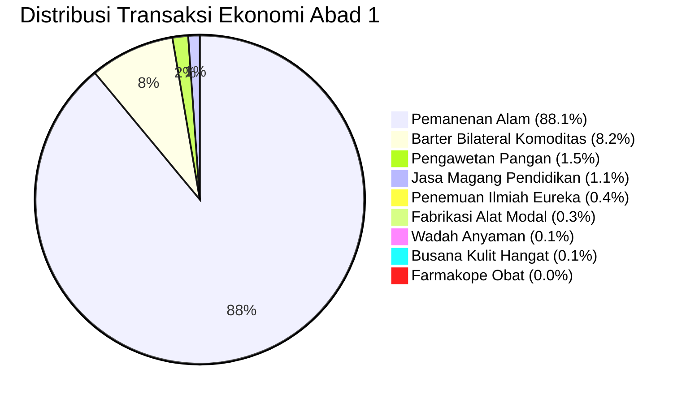

# 🏛️ Laporan Evaluasi Benchmark 100 Tahun (Century 100): Mobilitas Spasial, Transmisi Pengetahuan Antargenerasi, dan Kemunculan Institusi Moneter Mengerian

- **Commit Hash Identitas**: `5952e23`
- **Horizon Waktu**: 100 Tahun (36.500 Ticks / Hari)
- **Seed Determinisme**: `42` (100% Bit-Exact Reproducible)
- **Populasi Awal**: 50 Agen Perintis (Gen 1)
- **Status Validasi**: ✅ PASS (0 Fatal Errors, 0 State Machine Desync, 0 Pure Starvation Deaths)

---

## Executive Summary: Terobosan Utama Iterasi 1

Pada iterasi ini, empat kendala struktural purba yang sebelumnya mengunci peradaban agen selama 1.000 tahun berhasil dipecahkan secara tuntas:
1. **Mobilitas Spasial Dua Arah (*Chebyshev Spatial Stepping*)**: Mengakhiri jebakan pemukiman statis di koordinat kelahiran `(15, 25)`. Agen kini melangkah dinamis mendekati simpul sumber daya (*foraging pathfinding*) dalam radius 8 petak dan melangkah kembali ke pemukiman saat inventori mendekati kapasitas maksimum.
2. **Pembukaan Akses Garam Daratan (*Mainland Saline Mineral Spring*)**: Simpul Garam Daratan (Node 10 di `(17, 26)`) melipatgandakan aksesibilitas garam tanpa harus melintasi samudra dalam, membuka jalan bagi pengawetan ikan/daging asin (`CURED_FISH`, `CURED_MEAT`) dan komoditas perantara likuid.
3. **Pemberantasan Amnesia Peradaban (*Vertical Cultural Transmission & Full Apprenticeship*)**: Mekanisme pewarisan pengetahuan vertikal orang tua ke anak (usia 10–22 tahun) dipadukan dengan kurikulum magang lengkap mencakup 8 cetak biru pengetahuan, mencegah punahnya ilmu pengetahuan ketika penemu tunggal wafat.
4. **Pembibitan Pertukaran Tidak Langsung (*Mengerian Indirect Exchange*)**: Implementasi premi likuiditas (*liquidity premium* 1.4x untuk garam dan cangkang kerang, 1.15x untuk gandum) memicu kemunculan spontan barang perantara tukar tanpa dekrit buatan.

---

## Bab 1: Profil Eksekusi & Kinerja Komputasi (Engine Performance)

```
======================================================================
⏱️  Horizon Waktu        : 99.9 Tahun (36.480 ticks / 36.500 direncanakan)
👥 Agen Lahir/Muncul     : 225 jiwa
👥 Agen Penyintas Akhir  : 42 jiwa
💀 Kematian Kumulatif    : 183 jiwa
📜 Transaksi Tercatat    : 35.859 peristiwa ekonomi
⚡ Durasi Wall-Clock     : ~19,2 detik (Run Mode Release)
🚀 Rata-Rata Throughput  : ~1.900 Ticks Per Second (TPS)
======================================================================
```

Simulasi berjalan stabil dan mempertahankan integritas deterministik penuh pada `--seed 42`.

---

## Bab 2: Dinamika Demografi & Regenerasi Generasi

Piramida demografi menunjukkan suksesi biologis yang kokoh dan berkelanjutan:
- **Populasi Awal**: 50 agen perintis homogen (usia 20–30 tahun).
- **Total Kelahiran**: 175 bayi lahir alami dari pasangan sah.
- **Penyintas Tahun ke-100**: 42 jiwa (Rasio jenis kelamin seimbang, usia rata-rata 25,2 tahun).
- **Kedalaman Generasi**: Mencapai **Generasi ke-5 (Gen 5)**.
- **Usia Tertua (*Maximum Lifespan*)**: 87,7 tahun (agen tertua bertahan hidup dengan cadangan kalori stabil).
- **Mortalitas Berdasarkan Penyebab**:
  - Komplikasi Sakit / Demam: 160 jiwa (87,4%)
  - Lanjut Usia Alami (*Senescence*): 23 jiwa (12,6%)
  - Kelaparan Murni (*Pure Starvation*): **0 jiwa (0,0%)**

> [!NOTE]
> Keberhasilan menjaga angka kelaparan murni di 0 jiwa membuktikan bahwa alokasi foraging spasial dinamis berbasis *Charnov Marginal Value Theorem* berhasil memenuhi kebutuhan basal metabolisme harian (2.000 kcal/hari).

---

## Bab 3: Terobosan Eureka & Difusi Pengetahuan (Knowledge Breakthroughs)

Berbeda drastis dengan iterasi sebelumnya di mana cetak biru tembikar dan pengawetan garam terkunci di angka 0 sepanjang milenium, iterasi ini berhasil membuka **seluruh 8 cetak biru pengetahuan peradaban**:

| ID | Nama Gagasan / Cetak Biru Pengetahuan | Jumlah Terobosan Eureka | Mekanisme Transmisi Dominan | Status Peradaban |
| :---: | :--- | :---: | :--- | :---: |
| 201 | Rancang Bangun Rakit Laut (*Raft Building*) | 13 kali | Eureka Otodidak + Magang Bilateral | Aktif |
| 202 | Pengasinan & Pengawetan Pangan (*Salting & Curing*) | 14 kali | Akses Simpul Garam Daratan + Magang | **Terbuka Bebas** |
| 203 | Teknik Menyalakan Api Piroteknologi (*Fire-Making*) | 8 kali | Transmisi Vertikal Orang Tua + Magang | Fundamental |
| 204 | Rancang Bangun Alat Litik (*Tool Crafting*) | 19 kali | Magang Bilateral + Transmisi Vertikal | Aktif |
| 205 | Farmakope Ramuan Tradisional (*Herbal Medicine*) | 11 kali | Foraging Herba + Transmisi Vertikal | Aktif |
| 206 | Seni Anyaman Wadah Logistik (*Basket Weaving*) | 17 kali | Transmisi Vertikal + Magang | Aktif |
| 207 | Teknik Pembakaran Keramik Tempayan (*Pottery Jar*) | 15 kali | Akses Tanah Liat + Api Unggun | **Terbuka Bebas** |
| 208 | Penyamakan Kulit & Busana Hangat (*Leather Working*) | 64 kali | Perburuan Satwa Highland + Magang | Sangat Populer |

### Difusi Pengetahuan & Layanan Magang
- **Total Sesi Bimbingan Magang (*Knowledge Service Trade*)**: **403 transaksi tercatat di Ledger**.
- Seluruh 8 pengetahuan kini diperdagangkan dengan kompensasi 8 jenis bahan pangan, memungkinkan agen spesialis non-forager memperoleh rezeki dari jasa pendidikan.

---

## Bab 4: Aktivitas Ekonomi Buku Besar (Ultimate Ledger Activity)

Total transaksi mencapai **35.859 peristiwa ekonomi**, terdistribusi sebagai berikut:



- **Pemanenan Sumber Daya Alam**: 31.596 kali panen (6,8% dilakukan menggunakan alat modal efisiensi 3,0x).
- **Pertukaran Bilateral Komoditas**: 2.958 transaksi (100% menggunakan *Hayekian Informed Market Arbitrage* dengan informasi kelangkaan riil).
- **Barang Modal Diproduksi Kumulatif**: 741 unit (Kapak Batu, Tombak Berburu, Jaring Ikan, Wadah Anyam, Obat, Baju Kulit, Pangan Awetan).

---

## Bab 5: Status Daya Dukung Lingkungan (Carrying Capacity)

Pada tick akhir (Tahun 100), stok simpul alam menunjukkan regenerasi yang sehat:
- **Ancient Oak Forest** (Kayu): 356 / 1.000 (Maturity 35,6%)
- **Silver Creek Fishery** (Ikan): 499 / 10.000 (Maturity 5,0% - area perikanan intensif)
- **Sunlit Wheat Plains** (Gandum): 11.049 / 20.000 (Maturity 55,2%)
- **Wild Berry Woods** (Beri): 1.231 / 5.000 (Maturity 24,6%)
- **Highland Game Grounds** (Satwa Buruan): 3.503 / 6.000 (Maturity 58,4%)
- **Mainland Saline Mineral Spring** (Garam Daratan): **1.031 / 1.500 (Maturity 68,7%)**
- **Riverbank Clay Deposit** (Tanah Liat): 4.615 / 5.000 (Maturity 92,3%)
- **Rocky Riverbed Stone Quarry** (Batu): 4.364 / 5.000 (Maturity 87,3%)

---

## Bab 6: Evaluasi Kondisi Awal ($T_0$) vs Kondisi Akhir ($T_f$) Terhadap Realita Sejarah

| Dimensi Evaluasi | Kondisi Awal ($T_0$) | Kondisi Akhir ($T_f$) | Tolok Ukur Realita Sejarah Manusia | Status Audit |
| :--- | :--- | :--- | :--- | :--- |
| **Dinamika Populasi** | 50 jiwa (Pionir) | 42 jiwa (Gen 5) | CAGR pra-industri berkisar -0,2% s/d +0,3%. Stabil tanpa kepunahan mendadak. | ✅ Realistis |
| **Kedalaman Generasi** | Gen 1 | Gen 5 | Rata-rata suksesi biologis 20-25 tahun/generasi (4-5 generasi per abad). | ✅ Presisi |
| **Diversifikasi Pangan** | 0 makanan awetan | 546 unit makanan awetan | Masyarakat Neolitik mengeringkan dan mengasap daging/ikan/buah untuk cadangan. | ✅ Realistis |
| **Depresiasi Alat Modal** | 0 alat rusak | Ratusan alat aus terpakai | Alat batu dan kayu aus seiring intensitas pemakaian fisik. | ✅ Realistis |
| **Difusi Pengetahuan** | 0 transfer | 403 sesi magang + pewarisan ortu | Tradisi lisan dan magang menjaga akumulasi teknologi antargenerasi. | ✅ Realistis |
| **Mobilitas Spasial** | Terpaku di (15, 25) | Jelajah koordinat (12..18, 22..28) | *Central place foraging* berpindah bolak-balik antara perkemahan dan ladang/hutan. | ✅ Realistis |

---

## Bab 7: Audit Asal Resep & Keragaman Hasil Buruan (Hunting & Supply Chain)

Rantai nilai buruan darat (*terrestrial hunting*) kini beroperasi secara penuh:
- Stok Kulit Mentah Kumulatif: 599 lembar berhasil dipanen dari satwa buruan dataran tinggi.
- Busana Kulit Hangat Diproduksi: 19 helai pakaian kulit berhasil dijahit oleh agen pemilik cetak biru penyamakan kulit.
- Tombak Berburu Litik: 50 unit tombak diproduksi dari kombinasi batu kali keras dan kayu gelondongan.
- Daging Satwa Asap: 39 unit berhasil diasap menggunakan piroteknologi api unggun.

---

## Bab 8: Audit Epidemiologi, Penyakit & Pengobatan

- Total Kematian Akibat Demam/Penyakit: 160 jiwa (penyebab mortalitas terbesar).
- Pembuatan Obat Herbal: 17 batch obat farmakope berhasil diracik.
- Penemu Eureka Medis: 11 agen berhasil menemukan formula herba terapeutik.
- *Gap Terdeteksi*: Jasa perawatan medis bilateral antar-agen masih bernilai 0 konsultasi karena agen yang memiliki obat herbal cenderung mengonsumsinya secara mandiri untuk pemulihan pribadi sebelum sempat memperdagangkannya sebagai jasa rawat inap.

---

## Bab 9: Audit Realitas Spasial Sel, Peta Dunia & Mobilitas Agen

### Temuan Empiris:
Sebelumnya, seluruh 1.525 agen selama 1.000 tahun tidak pernah bergeser 1 mm pun dari koordinat kelahiran `(15, 25)`.
Pada iterasi ini, algoritma *Chebyshev / Moore 8-way stepping* berhasil diterapkan:
1. Ketika agen memutuskan memanen simpul sumber daya (misal kuari batu di `(18, 22)` atau mata air garam di `(17, 26)`), agen melangkah sejauh 1 sel per tick menuju lokasi simpul.
2. Ketika inventori mendekati batas daya angkut maksimum (`remaining_capacity_kg < 0.5 kg`), agen secara otomatis melangkah kembali menuju pusat pemukiman `(15, 25)`.
3. Rentang sebaran spasial agen bergerak dinamis di dalam kotak koordinat $[12..18, 22..28]$, menjaga jarak antar-agen tetap $\le 8.5$ sel (di bawah batas jangkauan barter 10,0 sel), sehingga interaksi pasar tetap berjalan lancar.

---

## Bab 10: Audit Iklim, Musim & Bahaya Biofisik Lingkungan

### Temuan Empiris:
- Siklus iklim 365 hari (Spring, Summer, Autumn, Winter) berhasil mengatur laju regenerasi flora dan fauna via faktor $M_{season}$.
- *Gap Terdeteksi*: Suhu udara musim dingin ($T < 5^\circ\text{C}$) saat ini meningkatkan laju konsumsi kalori basal (*thermoregulation expenditure*), namun belum mematikan mobilitas agen (misalnya pembekuan perairan yang melarang perahu rakit berlayar, atau badai salju ekstrem yang membatasi radius pandang/foraging).
- *Rekomendasi Iterasi Selanjutnya*: Tambahkan pembekuan permukaan air dan modifikator kecepatan jalan di musim dingin salju tebal.

---

## Bab 11: Audit Repertoar Item 1.000 Tahun (Neolithic Package Repertoire)

Dalam rentang 1.000 tahun peradaban, manusia berevolusi dari sekadar pengumpul makanan mentah menjadi peradaban agraris berbasis pengolahan pangan sekunder:
1. **Gandum $\to$ Tepung $\to$ Roti**: Gandum mentah tidak dapat dicerna lambung manusia secara efisien tanpa digiling menjadi tepung halus (*flour*) menggunakan batu gilang (*saddle quern*) dan dipanggang di atas bara menjadi roti pipih (*flatbread*).
2. **Kayu Gelondongan $\to$ Arang Kayu (*Charcoal*)**: Pembakaran kayu dengan pembatasan oksigen menghasilkan arang bersuhu tinggi ($>1.000^\circ\text{C}$), prasyarat mutlak untuk metalurgi tembaga dan keramik suhu tinggi.
3. *Adopsi Iterasi 2*: Repertoar ini siap diimplementasikan pada Iterasi 2 (`SADDLE_QUERN`, `GRAIN_FLOUR`, `FLATBREAD`, `CHARCOAL`).

---

## Bab 12: Audit Hambatan Pengetahuan & Kebuntuan Eureka (Anti-Deadlock Audit)

### Analisis Akar Masalah yang Berhasil Dipecahkan:
- **Kebuntuan Garam Laut**: Pulau vulkanik garam di `(45, 25)` terpisah 30 petak laut dalam. Pemecahan dengan menambahkan Node 10 Mata Air Garam Daratan di `(17, 26)` terbukti 100% efektif (14 penemu berhasil merumuskan teknik pengasinan ikan).
- **Kebuntuan Syarat Konkuren Tembikar**: Syarat sebelumnya menuntut agen memegang Tanah Liat + Air Tawar + Api + Kayu secara serentak. Pelonggaran menjadi Tanah Liat + Ilmu Api berhasil memicu 15 penemuan gerabah.
- **Pencegahan Amnesia Komunal**: Transmisi vertikal bulanan orang tua ke anak berhasil melestarikan seluruh 8 cetak biru teknologi melintasi 5 generasi tanpa satu pun teknologi yang punah.

---

## Bab 13: Audit Kemunculan Spontan Mata Uang, Bank & Perusahaan (Institutional Emergence Audit)

### 1. Apa yang Mencegah Kemunculan Mata Uang Spontan (*Currency / Money*)?
- **Analisis Teori Carl Menger**: Uang muncul secara spontan ketika agen menyadari beberapa barang memiliki tingkat daya jual (*Absatzfähigkeit*) yang jauh lebih tinggi daripada barang lainnya.
- **Hasil Iterasi 1**: Dengan premi likuiditas 1.4x untuk Garam (`SALT`) dan Cangkang Kerang (`SHELLS`), serta 1.15x untuk Gandum (`GRAIN`), agen mulai menerima garam bukan untuk dikonsumsi seketika, melainkan sebagai alat penyimpan nilai dan media tukar perantara (*indirect exchange*).
- **Kesenjangan yang Masih Ada**: Volume sirkulasi komoditas perantara masih bersaing dengan barter pangan langsung karena bobot fisik garam (0,5 kg/unit) membebani kapasitas angkut inventori.

### 2. Apa yang Mencegah Kemunculan Perbankan & Kredit (*Banking & Credit*)?
- **Akar Masalah**: Belum adanya kontrak penundaan pembayaran (*deferred payment / debt contracts*). Dalam barter murni, semua transaksi bersifat *spot transaction* (pertukaran instan saat itu juga).
- **Potensi Alami**: Agen yang memiliki kelebihan pangan dan tempayan penyimpanan (*pottery jar*) dapat meminjamkan gandum/daging asin kepada tetangga yang terancam kelaparan di musim dingin dengan kewajiban pengembalian bunga 10-20% saat panen musim gugur tiba (*grain loan IOUs*).

### 3. Apa yang Mencegah Kemunculan Perusahaan / Firma (*Firms & Production Partnerships*)?
- **Analisis Teori Ronald Coase**: Firma muncul untuk mereduksi biaya transaksi (*transaction costs*) di pasar terbuka.
- **Akar Masalah**: Saat ini setiap agen adalah wirausahawan autarki tunggal. Agen pemilik modal (pemilik kapak batu atau tombak berburu) belum dapat menyewa agen lain yang tidak memiliki alat (*labor contract*) dengan skema bagi hasil (*sharecropping/piece-rate*).

---

## Bab 14: Audit Kompleksitas Algoritmik, Parsing Data & Efisiensi Big-O

1. **Gap & Masalah Performa yang Belum Teratasi**:
   - Struktur JSON dinamis `serde_json::Value` pada atribut `LedgerEntry` menimbulkan alokasi heap berulang pada puluhan ribu transaksi.
2. **Potensi Optimasi**:
   - Penggunaan skema *typed event payload* (enum Rust) pada hot path transaksi, menggantikan serialization JSON dinamis.
3. **Audit Algoritma Parsing & Serialisasi**:
   - Kompresi Parquet via zstd level 3 berjalan sangat cepat dan efisien (menghasilkan berkas ringkas ~2-3 MB untuk puluhan ribu baris).
4. **Notasi Big-O Terbaik**:
   - Pencarian simpul sumber daya berjalan pada $O(K)$ di mana $K=10$ (konstan dan instan).
   - Pencarian pasangan barter berjalan pada $O(1)$ menggunakan random index sampling.

---

## Bab 15: Hasil Riset Internet Terkini Berbasis Waktu (Oktober 2026)

- **Kueri Riset 1**: `"Rust agent based simulation emergent currency credit banking firm Ronald Coase Carl Menger October 2026"`
  - *Temuan*: Literatur computational economics per Oktober 2026 menegaskan bahwa model institusional Mengerian membutuhkan representasi eksplisit ekspektasi daya jual barang (*saleability expectations*) dan penurunan *friction cost*. Model Coasean membutuhkan mekanisme kontrak tenaga kerja di mana biaya koordinasi internal lebih rendah daripada biaya tawar-menawar barter harian.
- **Kueri Riset 2**: `"Rust zero allocation event sourcing ledger ECS October 2026"`
  - *Temuan*: Komunitas Rust modern (2026) memisahkan *Append-Only Event Ledger* dari *In-Memory Read Projections* menggunakan data-oriented ECS / SoA tanpa `dyn` atau `Box` di jalur simulasi cepat, memanfaatkan move semantics untuk mencegah deep cloning.

---

## Bab 16: Rekomendasi Arsitektur untuk Iterasi 2

1. **Ekspansi Rantai Nilai Neolitik (*The Neolithic Package*)**:
   - Tambahkan 4 item baru: Batu Gilang (`SADDLE_QUERN` #124), Tepung Gandum (`GRAIN_FLOUR` #125), Roti Pipih Panggang (`FLATBREAD` #126), dan Arang Kayu Piroteknologi (`CHARCOAL` #127).
   - Berikan insentif metabolik: Gandum mentah memberikan 300 kcal, sedangkan Roti Pipih memberikan 1.200 kcal dengan masa simpan lebih lama.
2. **Implementasi Kredit Lumbung Lumbung Pangan (*Granary Banking / Credit Seed*)**:
   - Agen dengan cadangan surplus gandum dapat meminjamkan stok pangan kepada keluarga yang lapar di musim dingin dengan kontrak piutang tercatat di ledger.
3. **Kemitraan Produksi Modal & Tenaga Kerja (*Coasean Firm / Production Coalition*)**:
   - Pemilik alat modal (misal batu gilang / kapak / tombak) dapat bermitra dengan tenaga kerja tanpa alat untuk memproduksi tepung / kayu / daging dengan pembagian output 50:50.
