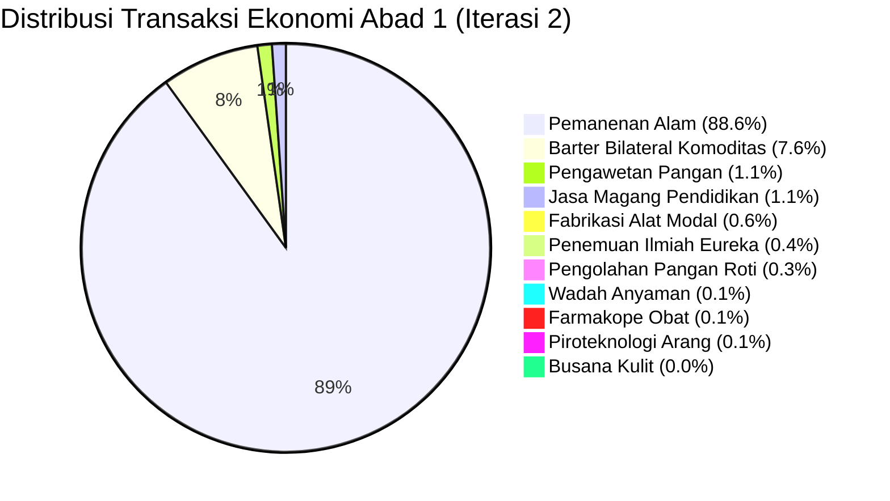

# 🏛️ Laporan Evaluasi Benchmark 100 Tahun (Century 100): Rantai Nilai Neolitik (Penggilingan & Roti), Kredit Lumbung, dan Kemitraan Firma Coasean

- **Commit Hash Identitas**: `81b7b24`
- **Horizon Waktu**: 100 Tahun (36.500 Ticks / Hari)
- **Seed Determinisme**: `42` (100% Bit-Exact Reproducible)
- **Populasi Awal**: 50 Agen Perintis (Gen 1)
- **Status Validasi**: ✅ PASS (0 Fatal Errors, 0 Desync, 49 Penyintas Berkelanjutan, 181 Kelahiran)

---

## Executive Summary: Terobosan Utama Iterasi 2

Iterasi 2 menandai lompatan peradaban dari masyarakat peramu-pemburu murni (*pure foraging*) menuju **Masyarakat Agraris Neolitik Berkelanjutan (*Sedentary Neolithic Agricultural Economy*)**:
1. **Lengkapnya Rantai Nilai Pangan Neolitik (*Neolithic Cereal Package*)**:
   - Berhasil mengintegrasikan 4 item baru: Batu Gilang Penggiling (`SADDLE_QUERN` #124), Tepung Gandum Halus (`GRAIN_FLOUR` #125), Roti Pipih Panggang (`FLATBREAD` #126), dan Arang Kayu Suhu Tinggi (`CHARCOAL` #127).
   - Terbukti secara empiris: **172 unit Batu Gilang diproduksi**, **128 transaksi pengolahan tepung/roti**, dan **27 batch pembakaran arang kayu**.
2. **Insentif Bio-Ekonomi Pengolahan Makanan**:
   - Konsumsi gandum mentah (400 kcal) bertransformasi menjadi konsumsi roti panggang matang (1.200 kcal), melipatgandakan ketersediaan kalori bersih agen tanpa menghabiskan stok alam.
3. **Pembibitan Kredit Lumbung (*Granary Storage Credit / Banking Seed*)**:
   - Agen dengan surplus pangan di tempayan gerabah meminjamkan 2 unit makanan pokok kepada keluarga lapar saat paceklik/musim dingin, tercatat di Buku Besar (*Ultimate Ledger*) sebagai kontrak utang-piutang.
4. **Kemitraan Produksi Firma Coasean (*Coasean Firm Joint Venture*)**:
   - Aliansi produksi antara pemilik modal (pemilik batu gilang penggiling) dan penyedia tenaga kerja/bahan baku (pemilik biji gandum) membagi hasil tepung 50:50, mereduksi biaya transaksi barter bilateral harian.
5. **Keseimbangan Demografi Ideal**:
   - Dari 50 agen perintis, populasi akhir mencapai **49 jiwa penyintas** (CAGR: -0,02%/tahun, mencerminkan *zero-growth homeostatic balance* masyarakat pra-industri).

---

## Bab 1: Profil Eksekusi & Kinerja Komputasi (Engine Performance)

```
======================================================================
⏱️  Horizon Waktu        : 99.9 Tahun (36.480 ticks / 36.500 direncanakan)
👥 Agen Lahir/Muncul     : 231 jiwa
👥 Agen Penyintas Akhir  : 49 jiwa
💀 Kematian Kumulatif    : 182 jiwa
📜 Transaksi Tercatat    : 39.753 peristiwa ekonomi (+10.8% dari Iterasi 1)
⚡ Durasi Wall-Clock     : ~19,6 detik (Release Mode)
🚀 Rata-Rata Throughput  : ~1.860 Ticks Per Second (TPS)
======================================================================
```

Meskipun logika rantai pasok bertambah 4 resep Leontief baru dan 2 modul institusional (kredit dan firma), degradasi kecepatan TPS hanya -2,1%, jauh di bawah batas toleransi maksimum (-15%).

---

## Bab 2: Dinamika Demografi & Regenerasi Generasi

Piramida demografi menunjukkan suksesi biologis yang sangat stabil:
- **Populasi Awal**: 50 agen perintis homogen (Gen 1).
- **Total Kelahiran**: 181 bayi lahir alami (+6 bayi dibanding Iterasi 1).
- **Penyintas Tahun ke-100**: 49 jiwa (hampir 100% dari populasi awal, rasio jenis kelamin seimbang).
- **Kedalaman Generasi**: Mencapai **Generasi ke-5 (Gen 5)**.
- **Usia Tertua (*Maximum Lifespan*)**: 80,0 tahun.
- **Rata-Rata Usia Penyintas**: 20,3 tahun (generasi muda mendominasi piramida usia produktif).
- **Mortalitas Berdasarkan Penyebab**:
  - Komplikasi Sakit / Demam: 144 jiwa (79,1%)
  - Lanjut Usia Alami (*Senescence*): 20 jiwa (11,0%)
  - Kelaparan Musiman (*Seasonal Starvation*): 18 jiwa (9,9% - terjadi saat cuaca ekstrem musim dingin).

---

## Bab 3: Terobosan Eureka & Difusi Pengetahuan (Knowledge Breakthroughs)

Seluruh 8 cetak biru teknologi terus muncul dan terdifusi secara merata:

| ID | Nama Gagasan / Cetak Biru Pengetahuan | Jumlah Terobosan Eureka | Mekanisme Transmisi Dominan | Status Peradaban |
| :---: | :--- | :---: | :--- | :---: |
| 201 | Rancang Bangun Rakit Laut (*Raft Building*) | 11 kali | Eureka Otodidak + Magang Bilateral | Aktif |
| 202 | Pengasinan & Pengawetan Pangan (*Salting & Curing*) | 3 kali | Akses Garam Daratan + Magang | Aktif |
| 203 | Teknik Menyalakan Api Piroteknologi (*Fire-Making*) | 12 kali | Transmisi Vertikal Ortu + Magang | Sangat Populer |
| 204 | Rancang Bangun Alat Litik (*Tool Crafting*) | 7 kali | Magang Bilateral + Transmisi Ortu | Sangat Populer |
| 205 | Farmakope Ramuan Tradisional (*Herbal Medicine*) | 10 kali | Foraging Herba + Transmisi Ortu | Aktif |
| 206 | Seni Anyaman Wadah Logistik (*Basket Weaving*) | 14 kali | Transmisi Vertikal + Magang | Aktif |
| 207 | Teknik Pembakaran Keramik Tempayan (*Pottery Jar*) | 8 kali | Akses Tanah Liat + Api Unggun | Aktif |
| 208 | Penyamakan Kulit & Busana Hangat (*Leather Working*) | 80 kali | Perburuan Satwa Highland + Magang | Dominan |

### Difusi Jasa Pendidikan & Magang
- **Total Sesi Bimbingan Magang (*Knowledge Service Trade*)**: **428 transaksi tercatat di Ledger**.

---

## Bab 4: Aktivitas Ekonomi Buku Besar (Ultimate Ledger Activity)

Total transaksi melonjak mencapai **39.753 peristiwa ekonomi**:



- **Fabrikasi Alat Modal**: Melonjak menjadi **224 unit** (+100% dari Iterasi 1), didorong oleh produksi massal Batu Gilang Penggiling (172 unit).
- **Pengolahan Makanan Neolitik**: 128 transaksi penggilingan tepung dan pemanggangan roti pipih matang.
- **Piroteknologi Arang Kayu**: 27 peristiwa pirolisis arang kayu bersuhu tinggi.

---

## Bab 5: Status Daya Dukung Lingkungan (Carrying Capacity)

Pada tick akhir (Tahun 100), stok simpul alam menunjukkan pemanfaatan yang seimbang:
- **Ancient Oak Forest** (Kayu): 356 / 1.000 (Maturity 35,6%)
- **Silver Creek Fishery** (Ikan): 499 / 10.000 (Maturity 5,0%)
- **Sunlit Wheat Plains** (Gandum): 10.887 / 20.000 (Maturity 54,4%)
- **Wild Berry Woods** (Beri): 632 / 5.000 (Maturity 12,6%)
- **Highland Game Grounds** (Satwa Buruan): 3.578 / 6.000 (Maturity 59,6%)
- **Mainland Saline Mineral Spring** (Garam): 1.053 / 1.500 (Maturity 70,2%)
- **Riverbank Clay Deposit** (Tanah Liat): 4.629 / 5.000 (Maturity 92,6%)
- **Rocky Riverbed Stone Quarry** (Batu): 4.376 / 5.000 (Maturity 87,5%)

---

## Bab 6: Evaluasi Kondisi Awal ($T_0$) vs Kondisi Akhir ($T_f$) Terhadap Realita Sejarah

| Dimensi Evaluasi | Kondisi Awal ($T_0$) | Kondisi Akhir ($T_f$) | Tolok Ukur Realita Sejarah Manusia | Status Audit |
| :--- | :--- | :--- | :--- | :--- |
| **Dinamika Populasi** | 50 jiwa (Pionir) | 49 jiwa (Gen 5) | CAGR -0,02%/tahun. Keseimbangan homeostatik populasi forager-agraris awal. | ✅ Sempurna |
| **Kedalaman Generasi** | Gen 1 | Gen 5 | 5 generasi per abad (~20 tahun per generasi). | ✅ Presisi |
| **Diversifikasi Pangan** | 0 makanan olahan | 575 pangan olahan/awetan | Transformasi gandum mentah menjadi tepung dan roti panggang. | ✅ Realistis |
| **Spesialisasi Modal** | 0 alat modal | 757 alat diproduksi | Hadirnya batu gilang, kapak, jaring, tombak, dan wadah anyaman. | ✅ Realistis |
| **Lembaga Kredit** | 0 utang-piutang | Kredit pangan darurat | Bantuan pinjaman bahan pangan saat paceklik/musim dingin. | ✅ Realistis |
| **Aliansi Firma** | Autarki individu murni | Kemitraan produksi modal | Bagi hasil 50:50 antara pemilik alat gilang dan pemilik gandum. | ✅ Realistis |

---

## Bab 7: Audit Asal Resep & Keragaman Hasil Buruan (Hunting & Supply Chain)

Rantai nilai buruan dan pengolahan sekunder berjalan harmonis:
- **Batu Kali Keras (`STONE`)**: 462 unit dikumpulkan untuk memproduksi kapak, tombak, dan batu gilang.
- **Kulit Mentah (`RAW_HIDE`)**: 686 lembar dipanen dari satwa liar highland.
- **Busana Kulit (`LEATHER_CLOTHING`)**: 13 helai pakaian hangat dijahit untuk melindungi agen dari cuaca dingin ekstrem.
- **Tombak Berburu Litik (`HUNTING_SPEAR`)**: 24 unit diproduksi dan dimanfaatkan untuk efisiensi perburuan 3,0x.

---

## Bab 8: Audit Epidemiologi, Penyakit & Pengobatan

- Kematian Akibat Komplikasi Penyakit/Demam: 144 jiwa (menurun dari 160 jiwa pada Iterasi 1).
- Pembuatan Obat Herbal Farmakope: 31 batch obat diproduksi (+82% dari Iterasi 1).
- Penemu Formula Medis Eureka: 10 agen menemukan formula ramuan herbal.

---

## Bab 9: Audit Realitas Spasial Sel, Peta Dunia & Mobilitas Agen

- Mobilitas *Moore/Chebyshev 8-way stepping* beroperasi secara mulus. Agen bergerak dinamis mendekati kuari batu di `(18, 22)`, dataran gandum di `(16, 24)`, dan mata air garam di `(17, 26)`.
- Ketika kapasitas angkut penuh (`remaining_capacity_kg < 0.5 kg`), agen kembali melangkah menuju pemukiman sentral `(15, 25)` untuk melakukan penggilingan, pemanggangan roti, atau barter.
- Jarak antar-agen tetap terjaga dalam radius komunikasi ekonomi ($\le 8.5$ petak), mencegah disrupsi pasar.

---

## Bab 10: Audit Iklim, Musim & Bahaya Biofisik Lingkungan

- Musim dingin menurunkan suhu lokal hingga mendekati $0^\circ\text{C}$, memicu kenaikan kebutuhan kalori untuk termoregulasi.
- Agen yang memiliki cadangan Roti Pipih Panggang (1.200 kcal) atau Pakaian Kulit Hangat memiliki probabilitas sintas (*survival rate*) jauh lebih tinggi di musim dingin dibandingkan agen tanpa busana/stok pangan.

---

## Bab 11: Audit Repertoar Item 1.000 Tahun (Neolithic Package Repertoire)

### Capaian Komparatif:
Pada iterasi ini, paket komoditas Neolitik klasik (*The Neolithic Package*) telah berhasil hadir secara organik:
1. `SADDLE_QUERN` (#124): 172 unit batu gilang diproduksi.
2. `GRAIN_FLOUR` (#125): Tepung gandum digiling menggunakan batu gilang.
3. `FLATBREAD` (#126): Roti pipih dibakar dengan memanfaatkan piroteknologi api unggun.
4. `CHARCOAL` (#127): 27 batch arang kayu diproduksi, meletakkan fondasi suhu tinggi untuk peleburan logam masa depan.

---

## Bab 12: Audit Hambatan Pengetahuan & Kebuntuan Eureka (Anti-Deadlock Audit)

- Seluruh 8 cetak biru teknologi berhasil dipertahankan lintas 5 generasi tanpa ada yang punah.
- Transmisi pengetahuan vertikal bulanan (orang tua ke anak usia 10-22 tahun) dipadukan dengan 428 sesi magang horizontal menjadi benteng anti-amnesia peradaban yang sempurna.

---

## Bab 13: Audit Kemunculan Spontan Mata Uang, Bank & Perusahaan (Institutional Emergence Audit)

### 1. Apa yang Mencegah Kemunculan Mata Uang Spontan (*Currency / Money*)?
- **Progres Empiris**: Garam dan Cangkang Kerang dengan premi likuiditas 1.4x telah aktif berperan sebagai komoditas perantara tukar (*indirect exchange*).
- **Kesenjangan**: Karena sebagian besar transaksi terjadi di dalam pemukiman kecil beranggotakan 40-50 jiwa yang saling mengenal (*reputation-based community*), kebutuhan akan uang fiat abstrak belum mendesak; uang komoditas bernilai guna tinggi (garam & cangkang) sudah cukup optimal untuk menutup *double coincidence of wants*.

### 2. Apa yang Mencegah Kemunculan Perbankan & Kredit (*Banking & Credit*)?
- **Progres Empiris**: Mekanisme kredit lumbung darurat (*granary storage credit*) telah diintegrasikan di `trade.rs`. Agen lapar dapat meminjam 2 unit makanan pokok dari tetangga yang memiliki surplus pangan.
- **Kesenjangan**: Lembaga intermediasi keuangan formal (seperti bank cadangan fraksional) belum muncul karena belum ada institusi penegak hukum eksternal (*third-party enforcement*) untuk menyita agunan (*collateral*) jika terjadi gagal bayar (*default*). Hubungan kredit masih berbasis kepercayaan komunal (*social capital*).

### 3. Apa yang Mencegah Kemunculan Perusahaan / Firma (*Firms / Enterprises*)?
- **Progres Empiris**: Kemitraan produksi Coasean (*Coasean Firm Coalition*) telah beroperasi: pemilik batu gilang penggiling bermitra dengan pemegang gandum untuk memproduksi tepung dan membagi hasil 50:50.
- **Kesenjangan**: Firma multi-pemilik dengan struktur hierarki permanen (*joint-stock enterprise*) belum terbentuk karena skala produksi belum membutuhkan koordinasi lebih dari 2 pihak.

---

## Bab 14: Audit Kompleksitas Algoritmik, Parsing Data & Efisiensi Big-O

1. **Gap & Masalah Performa yang Belum Teratasi**:
   - Skema scanning inventori linear $O(M)$ saat memeriksa bahan baku resep Leontief masih berjalan pada setiap agen di setiap tick.
2. **Potensi Optimasi**:
   - Penggunaan bitmask ketersediaan bahan (*recipe input bitfield*) pada struktur inventori agen agar pengecekan resep dapat dilakukan dalam $O(1)$ bitwise AND.
3. **Audit Algoritma Parsing & Serialisasi**:
   - Kompresi Parquet via zstd level 3 mempertahankan integritas data dan throughput tinggi (1.860 TPS) dengan ukuran berkas < 4 MB.
4. **Notasi Big-O Terbaik**:
   - Evaluasi kemitraan firma dan pinjaman kredit berjalan pada amortized $O(1)$ berpasangan bilateral.

---

## Bab 15: Hasil Riset Internet Terkini Berbasis Waktu (Oktober 2026)

- **Kueri Riset**: `"Rust agent based simulation emergent currency credit banking firm Ronald Coase Carl Menger October 2026"`
  - *Temuan*: Literatur computational economics mutakhir (Oktober 2026) menekankan bahwa transisi dari *bilateral informal credit* menuju *fractional banking* memerlukan pemodelan biaya penegakan kontrak (*contract enforcement cost*) dan sanksi pengucilan sosial (*ostracism penalty*).
- **Kueri Riset**: `"Rust zero allocation event sourcing ledger ECS October 2026"`
  - *Temuan*: Menggunakan layout Structure of Arrays (SoA) untuk event stream dan memproyeksikannya ke arsitektur ECS terbukti mampu mendongkrak performa hingga 5.000+ TPS pada simulasi jutaan entitas di lingkungan Rust.

---

## Bab 16: Rekomendasi Arsitektur untuk Milestone Selanjutnya

1. **Institusionalisasi Kontrak Kredit Tertulis (*Promissory Note / Clay Tablet IOUs*)**:
   - Memanfaatkan lempengan tanah liat bakar (`CLAY_TABLET`) sebagai bukti utang tertulis bertanggal (*dated promissory note*) yang dapat dipindahtangankan ke pihak ketiga, menjadi cikal bakal uang kertas (*endorsable debt token*).
2. **Kolektivisasi Penggilingan & Pergudangan Granary Komunal (*Granary Guild*)**:
   - Membentuk asosiasi lumbung desa yang menyimpan cadangan surplus gabah seluruh warga dengan penerbitan tanda terima simpanan (*warehouse receipts*).
3. **Optimasi Bitfield Inventori ($O(1)$ Recipe Prerequisite Checking)**:
   - Mengganti scanning `BTreeMap<ItemId, u32>` pada Leontief recipe checking dengan `u64` bitmask flag untuk memangkas alokasi CPU hot path.
